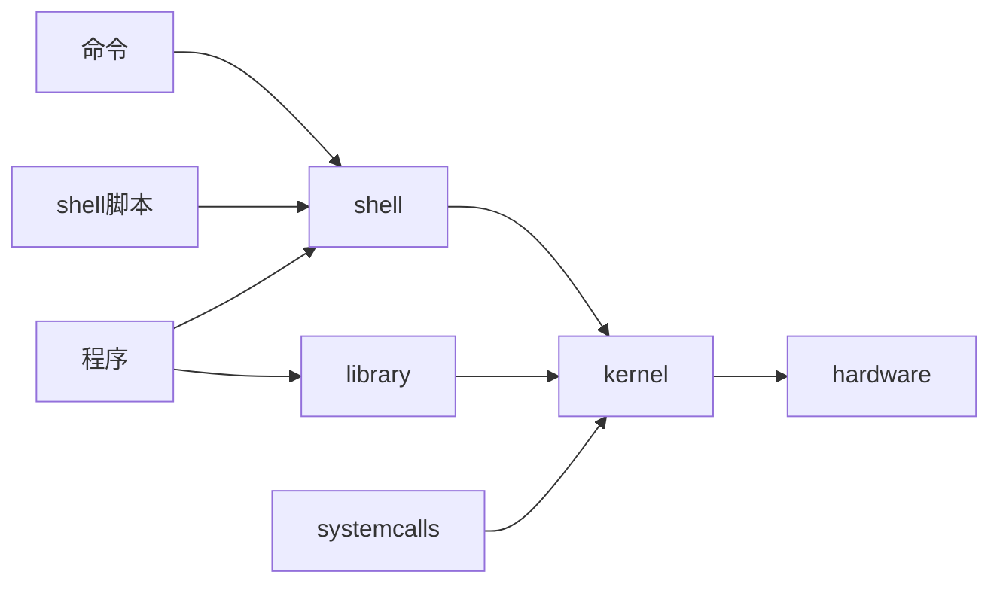

# 【周报】230213-0219.1~Linux系统结构与shell脚本的变量，判断语句if elsecase in，循环语句for while和shell函数

## Linux系统结构



### kernel

Linux是宏内核操作系统（所有的操作交给内核去执行），内核的系统调用负责：
|管理项目|具体内容
|-|-
|文件系统管理|不同的文件系统之间的数据交互
|网络管理|进程之间的通信
|进程管理|管理不同进程之间的调度
|内存管理|管理着虚拟内存和物理内存之间的映射
|硬件管理|控制着不同设备之间的运转

### shell

shell是一个命令行解释器，命令行提示符输入了字符串之后，shell会告诉内核去PATH中的文件夹里找和字符串相同的可执行文件。如果文件存在执行对应的文件的操作，如果不存在命令错误。

Ubuntu一般采用bash解释器

### Linux文件类型

|标志|类型
|-|-
|-|普通文件
|d|目录文件
|l|链接文件
|b|块设备文件
|c|字符设备文件
|p|管道文件
|s|套接字文件

## 常用shell命令

```shell
命令 选项 参数
```

### 用户

```shell
sudo #以超级用户执行一次命令
su   #进入超级用户

sudo adduser username #添加用户

cat /etc/passwd ## 查看用户是否添加成功

sudo deluser username #删除用户,残留用户文件夹
sudo rm -rf /home/username #删除用户文件夹

sudo deluser --remove-home username #删除用户及文件夹
```

### 输入输出

```shell
read #输入
echo #输出
```

#### 输出重定向

将本来输出到终端的内容重定向至文件

```shell
命令行 > 目标文件 #输出将覆盖目标文件原内容
命令行 >> 目标文件 #将输出追加在目标文件原内容之后
```

|>/>>|2>/2>>|&>/&>>|
|-|-|-
|只能重定向正确的输出|只能重定向正确的输出|正确和错误都可重定向

\>若只出现错误输出，则清空目标文件。
2>若只出现正确输出，则清空目标文件。

#### 输入输出转义

|形式|作用
|-|-
|无引号|正常输出$中的内容，空格只输出一个，单个\不输出
|单引号''|原样输出引号中的内容，不做任何修改
|双引号""|\会转义，$中的内容

### 文件类命令

#### 通配符

|通配符|匹配内容
|-|-
|\*|任意长度内容
|?|几个?就几个字符内容
|[a-z]|匹配a-z中任意一个单独数字的内容
|[anx]|anx各位数字为单独个体，只能匹配单独数字的相同内容
|[^anx]|匹配除了anx中出现的单独数字之外的其他单独数字文件

#### 显示路径下文件，到达路径，创建删除文件

```shell
ls
ls -l #显示当前路径下文件以及属性
ls -a #显示当前路径下所有文件包括.开头的隐藏文件

cd    #到家目录
cd .. #返回上一级目录
cd 绝对路径 
cd - #返回上一操作目录

touch 文件名 目标路径
mkdir 文件夹名 目标路径

rm
rm -r #递归删除文件夹
rmdir #删除空文件夹

cp 文件名 目标路径
mv 文件名 目标路径
```

#### 权限

Linux文件权限授权对象为UGO，即user，group，other。每个对象又有r（读）w（写）x（执行）三项权限。

所以每一个对象的三个项权限可以表示为三位二进制即：

000\~111，转换为八进制就是0\~7。

三个对象就是三位八进制数：

000~777

在家目录文件下，默认权限为664，即777的满权限减去文件掩码umask，之后十进制每一位逢奇数减1，逢偶数不变。

777-002=775-111=664

Linux更改文件权限有两种命令方式：

```shell
chmod u+w filename #授权对象+权限种类 文件名
chmod ddd filename #授权三位八进制数 文件名
```

#### 打包

```shell
tar -选项 包名 被打包文件
tar -选项 包名 -C 解包输出路径
```

tar选项：
|选项|功能内容
|-|-
|c|打包
|x|解包
|f|指定文件
|v|可视化
|z|指定工具gzip，包后缀.tar.gz
|j|指定工具bzip2，包后缀.tar.bz2

以上选项在命令行中组合使用。

#### 文件查找

```shell
find 路径 文件名
```

#### 查看内容

```shell
cat  #输出文件内容到终端
head #从头输出，默认十行
head -n #从头输出n行
tail #从尾输出，默认十行
tail -n #从尾输出n行
more #按照百分比格式显示文件
less #默认终端当作文件的显示器，按q退出模式
```

#### 内容查找

```shell
grep -选项 指定内容 文件名
```

grep选项：
|选项|功能内容
|-|-
|n|查找指定文件中指定内容
|v|查找指定文件中指定内容以外的内容
|c|统计指定文件中指定内容出现的行数

#### 链接文件

在链接有效时（此时指的是链接有效，并非链接文件是否能够打开/链接文件是否有效）改动链接文件内容，源文件内容与其他关联链接文件内容随之改变，改动源文件内容同理。

```shell
ln -s 源文件内容/目录 目标文件/目录 #软链接
ln 源文件内容/目录 目标文件/目录 #硬链接
```

软硬连接特性：
|链接类型|本质|与源文件的大小和权限|链接文件移动后|源文件删除后|删除后再创新源文件
|-|-|-|-|-|-
绝对路径软链接|快捷方式，存储源文件绝对路径|权限大小不同于源文件|有效|无效|与新源文件相同
相对路径软连接|快捷方式，存储源文件相对路径|权限大小不同于源文件|无效|无效|与新源文件相同
绝对路径硬链接|文件复制|权限大小与源文件相同|有效|有效|与创建链接文件时的的源文件相同
相对路径硬链接|文件复制|权限大小与源文件相同|有效|有效|与创建链接文件时的的源文件相同

#### 文件计数

```shell
wc 文件名
##  文件行数 单词数 字符数
```

#### 管道与参数提前

```shell
命令行a | 命令行B #管道
命令行b `命令行a` #参数提前
```

如以上例子：
管道指的是将前一个命令行a的标准输出通过管道转为下一个命令行b的标准输入。
参数提前与管道相同，将\`\`中命令行a的输出变为\`\`外命令行b的参数。

##### xargs

xargs可以将字符串转换为命令行参数，并且带有echo多行转一行的特性

```shell
find *c|xargs grep -n “int”
```

该例子表示将find找到的所有.c文件文件名转换为下一个命令行里需要输入文件名的参数。

## shell脚本

shell脚本时shell语句的集合，所以shell命令如何写shell脚本就如何写。c是强类型语言，shell是弱类型语言。

如何创建能够运行的shell脚本：
①创建.sh文件
②写shell脚本
③给脚本文件加上可执行权限
④./脚本名

shell脚本第一行是：

```shell
#! 解释器所在路径
```

### shell变量

#### 普通变量的定义和赋值

直接定义变量并赋值：

```shell
a=100
echo $a #输出a中的内容，如不带$，则直接输出a。
```

从命令中读取参数并赋值给变量：

```shell
read a
echo $a
```

#### 位置变量

将输入的命令行当作一个字符类型的指针数组

```shell
echo $n #意思就是打印输入命令的第n个字符串。
```

#### 系统预定义变量

|变量|功能
|-|-
|$@|显示命令除了可执行文件以外的命令
|$*|和$@一样
|$#|统计除了执行文件之外的其他内容的个数
|$?|返回上一行代码的退出状态，而不是脚本的状态

#### 环境变量

```shell
env #显示环境变量
export PATH=$PATH:需要加入环境变量的路径 #临时更改环境变量
```

临时改变环境变量指的是在当前终端窗口下有效。如果需要永久改变环境变量，那么需要在~/.bashrc文件中加入export更改环境变量语句。

### shell语句

#### 计算语句


<font color="red">！注意空格</font> 

```shell
expr number1 + number2
expr number1 - number2
expr number1 \* number2
expr number1 / number2
```

#### 空间语句

```shell
seq 首数 尾数
```

表示首数尾数间的整数序列

#### 测试语句

<font color="red">！注意空格</font> 

```shell
test n1 选项 n2
[ n1 选项 n2 ]
```

整型测试选项
|选项|功能
|-|-
|n1 -gt n2|数1是否大于数2
|n1 -lt n2|数1是否小于数2
|n1 -ge n2|数1是否大于等于数2
|n1 -le n2|数1是否小于等于数2
|n1 -eq n2|数1是否等于数2

字符串测试选项
|选项|功能
|-|-
|str1 = str2|字符串1是否等于字符串2
|str1 != str2|字符串1是否不等于字符串2
|-z str|字符串是否为零
|-n str|字符串是否不为零

文件属性测试选项
|选项|功能
|-|-
|-r file|是否具有可读权限
|-w file|是否具有可写权限
|-x file|是否具有可执行权限
|-f file|是否为普通文件
|-d file|是否为目录文件
|-l file|是否为链接文件
|file1 -filet file2|是否file1比file2新
|file1 -ot file2|是否file1比file2旧
|-s|文件是否为零

#### 选择判断语句

##### if else

例子：

判断文件如是普通文件输出内容，如是目录文件输出目录中的文件，都不是打印“noting”。

```shell
#! /bin/bash

read file
if [ -f $file ]
then
    cat $file
elif [ -d file ]
then
    ls $file
else
    echo nothing
fi
```

##### case in

例子：
输入1/2/3则输出1/2/3，输入其他则输出“*”。

```shell
#! /bin/sh

read a
case $a in
    1)
        echo 1
        ;;
    2)
        echo 2
        ;;
    3)
        echo 3
        ;;
    *)
        echo '*'
        ;;
esac
```

<font color="red">注意：不同于C语言中的switch case，case in型语句每一个选项都会默认break。</font> 

#### 循环语句

##### for循环

依次输出num1到num2之间的整数，包含num1与num2本身。

```shell
#! /bin/bash

read num1 num2
for i in `seq $num1 $num2`
do
    echo $i
done
```

##### while循环

例子：
一直打印a

```shell
while true
do
    echo a
done
```

### shell函数

```shell
函数名(){
    命令表
}
```

#### 拾遗之cat命令

经过实践可知，shell命令中的cat命令无法封装为函数，若封装为函数会出现段错误。

```shell
#! /bin/bash

read file1 file2
sta(){
    echo `wc $file1`
    echo `wc $file2`
}
#cat(){
#}
connect(){
    cat $file1 >>$file2
}
cp(){
    cat $file1 >$file2
}

if [ -f $file1 ] && [ -f $file2 ]
then
    while true
    do
        read sel
        case $sel in
            "sta")sta $file1 $file2
                ;;
            "cat")cat $file1
                cat $file2
                ;;
            "connect")connect $file1 $file2
                ;;
            "cp")cp $file1 $file2
                ;;
            *) break
            ;;
        esac 
    done
else
    echo err
fi
```
