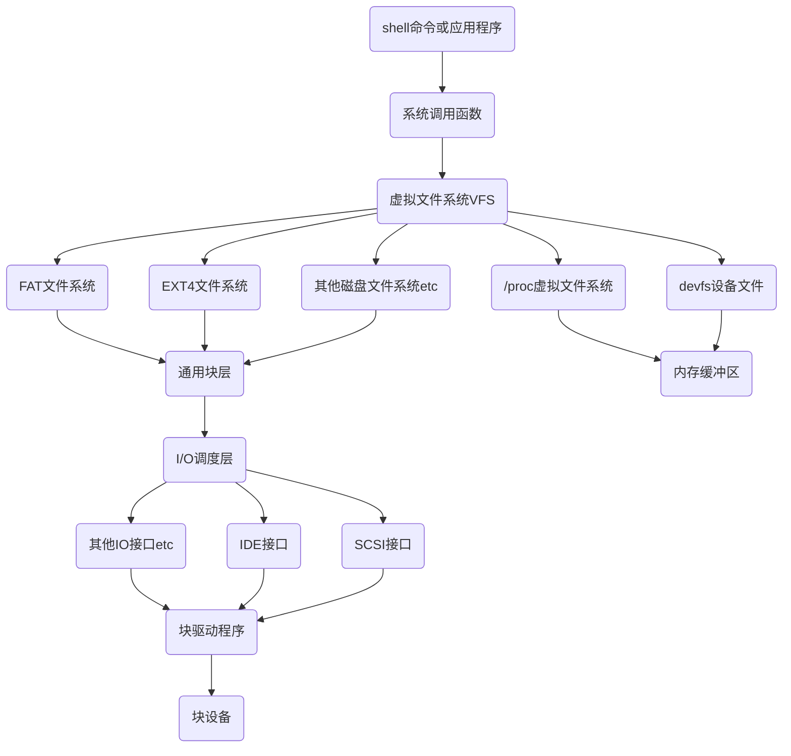

# 【周报】230227-0305.2~Linux_kernel系统调用，标准IO与文件IO的区别

[toc]

## Linux kernel结构

1. 内存管理单元
   * 内存分配和管理：虚拟地址（0~4G）线性地址，物理地址。
2. 进程管理单元
   *程序---->任务（单进程，多进程，单进程多线程）
死的---->活的
3. 文件系统
   * 文件系统是操作的系统提供给用户和计算机交互的接口。
   * 组织文件管理文件
4. 网络模块：提供网络协议栈等功能
5. 驱动模块：提供设备驱动

## Linux文件系统的结构

## 系统调用

用户或者程序通过系统kernel提供的系统调用接口（一系列函数），实现对kernel的使用，从而访问硬件。

### 为什么使用系统调用

1. 保护稀有资源
2. 提供用户访问稀有资源的接口
3. 防止用户访问稀有资源的竞态导致稀有资源被破坏

## 计算机I/O

计算机I/O即计算机输入输出，根据封装来源的不同，分为标准I/O和文件I/O。
|区别点|标准IO|文件IO
|-|-|-
来源|标准C库的函数|POISX系统调用
效率|效率高|效率低
缓冲机制|有|无
可移植性|只要有标准C库就能用|仅限于类UNIX操作系统
使用的函数|fopen,fread,fwrite,fclose|open,read,write,close
可操作性的对象|在Linux下只能操作普通文件|可以操作文件和设备
操作对象|FILE*（文件流指针）|文件描述符

### 两种I/O数据传输过程

实际上标准库I/O也是使用系统提供的系统调用接口实现I/O功能，只不过在堆区自动开辟了缓冲区。

通过标准C库使用标准I/O进行文件读写，和直接通过系统函数进行系统调用的过程为下图：

