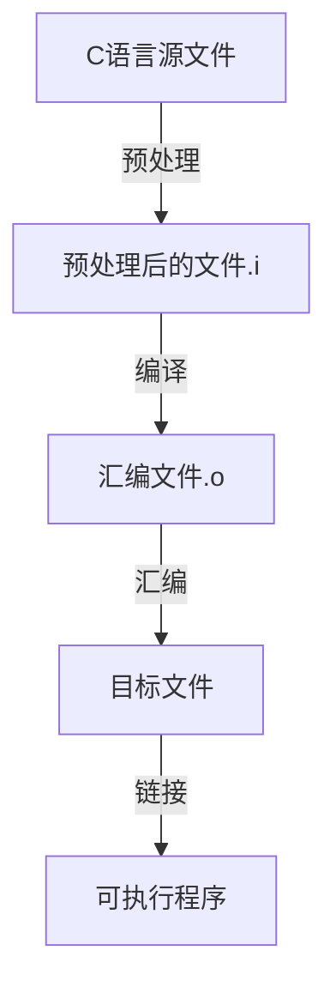

# 【周报】230306-0312.2~Linux程序的静态库&动态库制作

## GCC编译流程

GCC编译流程一般分为四个步骤：

1. 将C语言源程序预处理，生成.i文件。
2. 预处理后的.i文件编译成为汇编语言，生成.s文件。
3. 将汇编语言文件经过汇编，生成.o文件。
4. 将各个模块的.o文件链接起来生成可执行程序文件。



## library

程序库，一般是软件作者为了发布方便、替换方便或二次开发目的，而发布的一组可以单独与应用程序进行compile time或runtime链接的二进制可重定位目标码文件。是编译完成不可执行的二进制代码。

又因为链接阶段不同分为静态库和动态库。

|区别点|静态库|动态库|
|-|-|-
|链接阶段|编译时链接|运行时链接
|文件后缀|.a/.lib|.so/.dll
|共享性|无|有
|可移植性|需要静态编译，操作方便|需要反复交叉编译
|可执行文件大小|生成的可执行文件较大|并没有直接编译到可执行，所以可执行文件相对较小
|制作过程|ar -crv libxxx.a xxx.o|gcc -shared -fPIC -c xxx.c -o libxxx.so
|使用场景|不要求共享排除环境变量的干扰，可执行文件不表达，软件版本相对稳定，很少升级|有共享性要求，软件版本升级频繁，有远程部署和升级需求。

### 静态库制作

制作静态库实例的makefile脚本：

```makefile
#----------------------------------------------------------
#总makefile
#----------------------------------------------------------
CC=gcc
RM=rm -rf
OBJS=secret.o copy.o
CO=*.o
CA=*.a
#将预定以变量添加到工程
export CC RM OBJS CO CA
mf:
	make -C ./src/
	make -C ./obj/
	gcc main.c -Llib -lstate
#链接时-L跟的是相对目录，-l跟的是去掉前后缀的库文件名
.PHONY:clean
clean:
	${RM} ./obj/${CO}
	${RM} ./lib/${CA}
	${RM} ./a.out
#----------------------------------------------------------
#./src/路径下的汇编mekefile
#----------------------------------------------------------
obj:${OBJS}
	mv *.o ../obj
secret.o:secret.c
	${CC} -c $< -o $@
copy.o:copy.c
	${CC} -c $< -o $@
#----------------------------------------------------------
#./obj/路径下的链接静态库makefile
#----------------------------------------------------------
lib:libstate.a
	mv *.a ../lib
libstate.a:${OBJS}
	ar -crv libstate.a copy.o secret.o
```

### 动态库制作

制作动态库实例的makefile脚本：

```makefile
#----------------------------------------------------------
#总makefile
#----------------------------------------------------------
CC=gcc
RM=rm -rf
OBJS=secret.o copy.o
CO=*.o
SO=*.so
#将预定以变量添加到工程
export CC RM OBJS CO SO
mf:
	make -C ./src/
	make -C ./obj/
	gcc main.c -Llib -lstate 
#链接时-L跟的是相对目录，-l跟的是去掉前后缀的库文件名
.PHONY:clean
clean:
	${RM} ./obj/${CO}
	${RM} ./lib/${SO}
	${RM} ./a.out
#----------------------------------------------------------
#./src/路径下的汇编mekefile
#----------------------------------------------------------
obj:${OBJS}
	mv *.o ../obj
secret.o:secret.c
	${CC} -fpic -c $< -o $@
copy.o:copy.c
	${CC} -fpic -c $< -o $@
#----------------------------------------------------------
#./obj/路径下的链接静态库makefile
#----------------------------------------------------------
lib:libstate.so
	mv *.so ../lib
libstate.so:${OBJS}
	gcc -shared -o libstate.so copy.o secret.o
```
