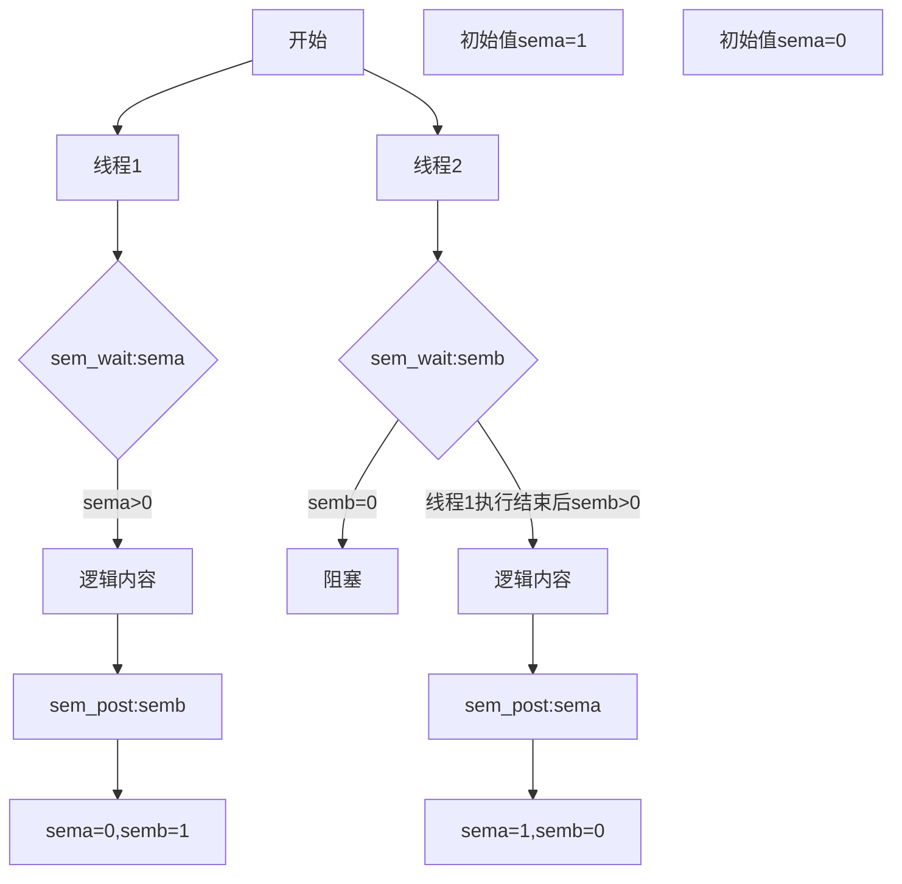
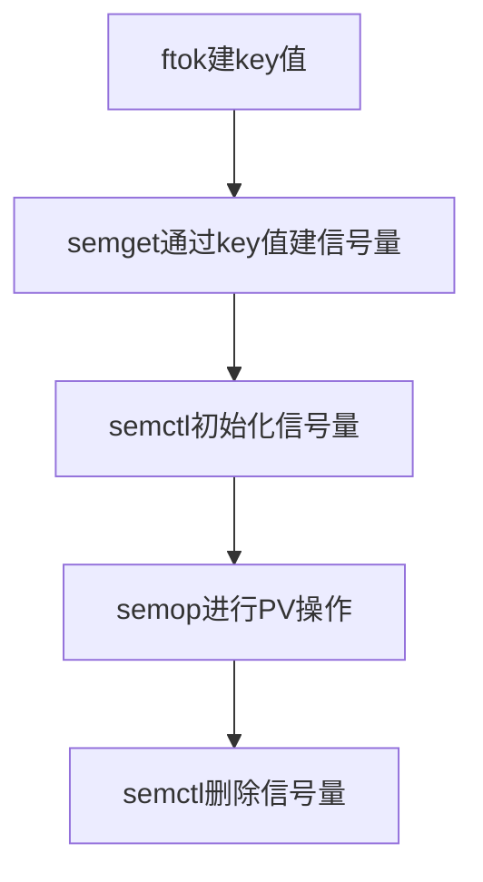

# 进线程同步互斥

[toc]

## 同步&互斥

### 为何需要同步

因为进线程具有异步性，即进线程间互不影响，并发执行，但很多情况需要进线程间互相配合以一定的顺序执行，这个时候就需要进行进线程同步，例如管道通信时的写进程需要先执行，又例如TCPIP通信时需要先建立accept接收客户端连接，客户端连接套接字才能成功connect。此时就需要进程或者线程同步。

### 为何需要互斥

同样因为进线程具有异步性，但硬件资源有限，比如摄像头之类的硬件，这些硬件无法像进线程一样并发使用，而是需要在一段较长时间（因为多进线程本质也是时间片极短的分时假并发）内被一个进线程独占使用，此时就需要进程或者线程互斥。

## 同步实现

进线程同步目前通过信号量实现。

### 信号量

信号量笔者个人理解为一种特殊的全局变量。

```c
#include <semaphore.h>

sem_t semname;
```

以上为无名信号量声明，通过信号量操作函数操作信号量数值进行线程间同步。

### sem_wait

```c
#include <semaphore.h>

int sem_wait(sem_t *sem);
```

以下为手册描述：
>sem_wait()  decrements  (locks) the semaphore pointed to by sem.  If the semaphore's value is greater than zero, then the decrement proceeds, and the function returns, immediately.If the semaphore currently has the value zero, then the call blocks until either it becomes possible to perform the decrement (i.e., the semaphore value rises  above  zero),or  a signal handler interrupts the call.

实际用法：

sem|现象
|-|-
|0|阻塞线程
|>0|sem=sem-1

sem_wait扩展：

```c
//如果无法进入返回错误返回值
int sem_trywait(sem_t *sem);
//设定超时时间
int sem_timedwait(sem_t *sem, const struct timespec *abs_timeout);
```

### sem_post

```c
#include <semaphore.h>

int sem_post(sem_t *sem);
```

以下为手册描述：
>sem_post()  increments  (unlocks) the semaphore pointed to by sem.  If the sema‐phore's value consequently becomes greater than zero, then  another  process  or thread  blocked  in  a sem_wait(3) call will be woken up and proceed to lock the semaphore.

实际用法：

|sem|现象
|-|-
|any value|sem=sem+1

### 信号同步思路



### 线程同步

线程同步使用无名信号量

无名信号初始化函数：

```c
#include <semaphore.h>

int sem_init(sem_t *sem, int pshared, unsigned int value);
```

```c
//sem_wait(sem_t) 参数遇到>0继续，参数-1；遇到0阻塞。
//sem_post(sem_t) 参数+1。
#include<stdio.h>
#include<pthread.h>
#include<string.h>
#include<unistd.h>
#include<semaphore.h>

sem_t sema;
sem_t semb;

void *threadf1(void *arg){
    int i=20;
    while(i--){
        sem_wait(&sema);
        printf("pht1 ");
        sleep(1);//制造混乱
        sem_post(&semb);
    }
}
void *threadf2(void *arg){
    int i=20;
    while(i--){
        sem_wait(&semb);
        printf("pht2\n");
        //sleep(1);
        sem_post(&sema);
    }
}

int main(){
    pthread_t pthid1=-1;
    pthread_t pthid2=-1;
    sem_init(&sema,0,1);
    sem_init(&semb,0,0);
    if(0!=(pthread_create(&pthid1,NULL,threadf1,NULL))){
        printf("creat pth1 err\n");
        return -1;
    }
    if(0!=(pthread_create(&pthid2,NULL,threadf2,NULL))){
        printf("creat pth2 err\n");
        return -1;
    }
    pthread_join(pthid1,NULL);
    pthread_join(pthid2,NULL);
    printf("process\n");
    return 0;
}
```

### 进程同步

有名信号量初始化：

```c
#include <fcntl.h>           /* For O_* constants */
#include <sys/stat.h>        /* For mode constants */
#include <semaphore.h>
sem_t *sem=sem_open(const char *name, int oflag);
sem_t *sem=sen_open(const char *name, int oflag,mode_t mode, unsigned int value);
```

sem_open返回值：成功，指向信号量的指针；失败，SEM_FAILED。

又名信号量存放在/dev/shm里，所以创建有名信号量时不需要指定信号量的存放路径。

a程序：

```c
#include <stdio.h>
#include <unistd.h>
#include <fcntl.h>
#include <sys/stat.h>
#include <semaphore.h>

int main(){
    sem_t *sem1=sem_open("sem1n",O_CREAT,0666,1);
    sem_t *sem2=sem_open("sem2n",O_CREAT,0666,0); 
    while(1){
        sem_wait(sem1);
        printf("a\n");
        sleep(1);
        sem_post(sem2);
    }
    return 0;
}
```

b程序：

```c
#include <stdio.h>
#include <unistd.h>
#include <fcntl.h>
#include <sys/stat.h>
#include <semaphore.h>

int main(){
    sem_t *sem1=sem_open("sem1n",O_CREAT,0666,1);
    sem_t *sem2=sem_open("sem2n",O_CREAT,0666,0); 
    while(1){
        sem_wait(sem2);
        printf("b\n");
        sleep(1);
        sem_post(sem1);
    }
    return 0;
}
```

## 互斥实现

### 线程互锁

线程锁：

```c
#include <pthread.h>
//声明
pthread_mutex_t mutex;
//初始化
pthread_mutex_init(&mutex,NULL);
//上锁，该函数之后的代码为上锁阻塞部分
pthread_mutex_lock(&mutex);
//解锁
pthread_mutex_unlock(&mutex);
```

线程互锁实例：

```c
#include<stdio.h>
#include<pthread.h>
#include<string.h>
#include<unistd.h>

pthread_mutex_t mutex;

void *threadf(void *arg){
    char *p=(char *)arg;
    static char buf[11]={0};
    int i=0;
    pthread_mutex_lock(&mutex);
    for(i=0;i<11;i++){
        buf[i]=p[i];
        usleep(500);
    }
    printf("%s\n",buf);
    pthread_mutex_unlock(&mutex);
}

int main(){
    pthread_t pthid1=-1;
    pthread_t pthid2=-1;
    char str1[]="abcdefghij";
    char str2[]="1234567890";
    pthread_mutex_init(&mutex,NULL);
    if(0!=(pthread_create(&pthid1,NULL,threadf,(void *)str1))){
        printf("creat pth1 err\n");
        return -1;
    }
    if(0!=(pthread_create(&pthid2,NULL,threadf,(void *)str2))){
        printf("creat pth2 err\n");
        return -1;
    }
    pthread_join(pthid1,NULL);
    pthread_join(pthid2,NULL);
    printf("process\n");
    return 0;
}
```

## 进程信号量集

### ftok

```c
#include <sys/types.h>
#include <sys/ipc.h>

key_t ftok(const char *pathname, int proj_id);
```

||pathname|proj_id|
|-|-|-
|说明|指定文件路径文件名|子序号，8bit无符号整数，0~255|

ftok根据路径名，提取文件信息，再根据文件信息和proj_id合成key。

ftok合成的key值被用于进程信号量，共享内存，消息队列的标识中介量。

### semget

```c
#include <sys/types.h>
#include <sys/ipc.h>
#include <sys/sem.h>

int semget(key_t key, int nsems,int semflg);
```

||key|nsems|semflg
|-|-|-|-
|说明|ftok返回值|信号量个数|信号量集访问权限，通常为IPC_CREAT\|三位八进制数|

### semctl

```c
#include <sys/types.h>
#include <sys/ipc.h>
#include <sys/sem.h>

int semctl(int semid, int semnum, int cmd, ...);
```

||semid|semum|cmd|
|-|-|-|-
|说明|信号量集ID|要修改的信号量编号|GETVAL获取信号量的值;SETVAL设置信号量的值;IPC_RMID删除信号量集|

### 构建信号量集



信号量集：

```c
#include<stdio.h>
#include<sys/ipc.h>
#include<sys/sem.h>
#include <sys/types.h>
#include <unistd.h>

union semun{
    int val;
};

void pop(int index,int semid){
    struct sembuf sop;
    sop.sem_num=index;
    sop.sem_op=-1;
    sop.sem_flg=0;
    semop(semid,&sop,1);
}

void vop(int index,int semid){
    struct sembuf sop;
    sop.sem_num=index;
    sop.sem_op=1;
    sop.sem_flg=0;
    semop(semid,&sop,1);
}

int main(){
    key_t key=ftok(".",20);
    if(-1==key){
        printf("ftok error\n");
        return -1;
    }
    printf("ftok ok\n");
    int semid=semget(key,128,IPC_CREAT|0755);
    if(semid<0){
        printf("semget error\n");
        return -1;
    }
    printf("semget ok\n");
    union semun m;
    m.val=0;
    semctl(semid,0,SETVAL,m);

    m.val=1;
    semctl(semid,1,SETVAL,m);
    
    pid_t pid;
    pid=fork();
    if(pid<0){
        printf("fork error\n");
        return -1;
    }
    else if(pid==0){
        while(1){
            pop(0,semid);
            printf("child process\n");
            vop(1,semid);
        }
    }
    else{
        while(1){
            sleep(1);
            pop(1,semid);
            printf("parent process\n");
            vop(0,semid);
        }
    }

    return 0;
}
```

## 总结

说白了，所有都是flag的标记思路，无非想尽办法在一块双方甚至多方都能看见的地方做出标记。
