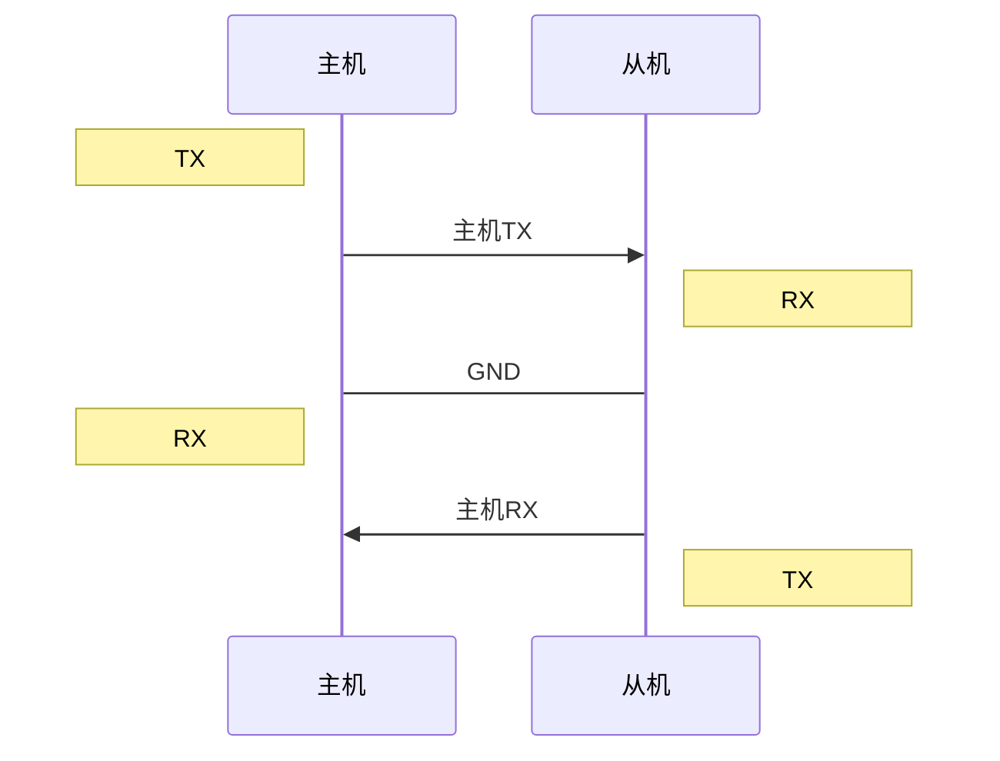

# Serial Communication&UART（串行通信与通用异步收发）附STM32平台采用DMA以UART方式收发不定长信息

## Serial communication（串行通信）

串行通信是一种相对于并行通信的概念。指的是信号在1bit带宽的线路上进行传输；例如一字节信息即八位需要一位一位由高位到低位或由低位到高位逐位传输，而并行通信则是多bit带宽线路，传输以字节信息可能是八位同时发送，通过信号线判断所在位的信号，缺陷在于多条线信号同步要求很高，在实际干扰环境下通信效率可能不如串行通信。

直到这里串行通信的概念只是一个十分笼统的理论模型，并没有规定任何协议而只是一个通信思路。不涉及OSI模型的任何一层。

UART，SPI,I²C，CAN都是串行通信的思想。

## UART（通用异步收发）

UART是一种将串行通信思想付诸实现的一种，串行，异步通信总线协议，囊括了232，485等各类接口标准规范和总线标准规范。UART协议较为宽泛地规定了标准，涉及OSI模型的物理层和数据链路层。

### 物理层

| 协议项         | 协议内容                                               |
| -------------- | ------------------------------------------------------ |
| 通信模式       | 全双工                                                 |
| 链接线电气特性 | 全双工模式3根线：TX（发送线）,RX（接收线）,GND（地线） |
| 电平值         | 视具体协议                                             |
| 速度           | 波特率：1200bit/s~115200bit/s                          |
| 主从模式       | 单主单从，一一对应，互为主从，主从波特率需要一致       |



### 数据链路层

UART协议帧格式（一般是高位->低位）：

| 位         | bit数   | 具体操作                                               |
| ---------- | ------- | ------------------------------------------------------ |
| 起始位     | 1 bit   | 不传输时保持高电平，拉低到低电平保持一个波特周期即生效 |
| 数据位     | 5~8 bit | 一般传输一个字节，所以是8bit                           |
| 奇偶效验位 | 0~1 bit | 0：数据位中1的个数是偶数，1：数据位中1的个数是奇数     |
| 停止位     | 1~2 bit | 从低电平拉升到高电平保持一到两个电平周期即生效         |

传输时帧内无间隔，相邻两帧间隔任意时长。

### UART&USART

USART相较于UART的不同点：

|          | UART                                             | USART                                                |
| -------- | ------------------------------------------------ | ---------------------------------------------------- |
| 传输线   | 信号线，地线                                     | 信号线，地线，时钟线                                 |
| 波特率   | 从机需要知道主机的波特率                         | 从机不需要知道主机的波特率，来源于主控提供的时钟信号 |
| 传输单位 | 由若干bit组成的字符                              | 由若干字符组成的信息帧（块）                         |
| 单位格式 | 起始位+数据位+奇偶校验位+停止位                  | 同步字符+数据位+字符校验位                           |
| 传输间隔 | 相邻两个字符间隔任意时长                         | 一个信息帧内，字符与字符之间无间隔                   |
| 时钟信号 | 时序要求低，使用各自的时钟信号，只需要波特率相同 | 时序要求高，使用同频同相的时钟路线                   |
| 优点     | 简单                                             | 传输效率高                                           |
| 缺点     | 传输效率低（传输一个字符要增加20%的附加信息位）  | 复杂                                                 |

## STM32平台采用DMA以UART方式收发不定长信息（使用Cube MX生成HAL库）

主函数核心代码：

```c
#define LENGTH 128

uint8_t rxcount;
uint8_t rxbuf[LENGTH]={0};
extern uint8_t rxflag;
extern DMA_HandleTypeDef hdma_usart1_rx;

int fputc(int ch,FILE *fp){
  HAL_UART_Transmit(&huart1,(uint8_t *)&ch,1,HAL_MAX_DELAY);
  return ch;
}

int main(void)
{
  __HAL_UART_ENABLE_IT(&huart1,UART_IT_IDLE);
  HAL_UART_Receive_DMA(&huart1,(uint8_t *)rxbuf,LENGTH);

  while (1)
  {
    if(rxflag==1){
      rxflag=0;
      HAL_UART_DMAStop(&huart1);
      rxcount=LENGTH-__HAL_DMA_GET_COUNTER(&hdma_usart1_rx);
      HAL_UART_Transmit(&huart1,(uint8_t *)rxbuf,rxcount,HAL_MAX_DELAY);
      memset(rxbuf,0,LENGTH);
      HAL_UART_Receive_DMA(&huart1,(uint8_t *)rxbuf,LENGTH);
    }
  }
}
```

中断句柄核心代码：

```c
volatile uint8_t rxflag=0;
extern DMA_HandleTypeDef hdma_usart1_rx;
extern UART_HandleTypeDef huart1;

void USART1_IRQHandler(void)
{
  HAL_UART_IRQHandler(&huart1);
  //USART_SR(IDLE位:Bit 4,只读)
  //当一帧数据接收完成线路空闲后IDLE便会置1中断
  if((__HAL_UART_GET_FLAG(&huart1,UART_FLAG_IDLE))==SET){
    __HAL_UART_CLEAR_IDLEFLAG(&huart1);
    rxflag=1;
  }
}
```

USART_SR IDLE位说明:

>This bit is set by hardware when an Idle Line is detected. An interrupt is generated if the IDLEIE=1 in the USART_CR1 register. It is cleared by a software sequence (an read to the USART_SR register followed by a read to the USART_DR register).
>
>* 0: No Idle Line is detected
>* 1: Idle Line is detected
>
>Note: The IDLE bit will not be set again until the RXNE bit has been set itself (i.e. a new idle line occurs).

USART_CR1 IDLEIE位说明：

>IDLEIE: IDLE interrupt enable
>This bit is set and cleared by software.
>
>* 0: Interrupt is inhibited
>* 1: A USART interrupt is generated whenever IDLE=1 in the USART_SR register
