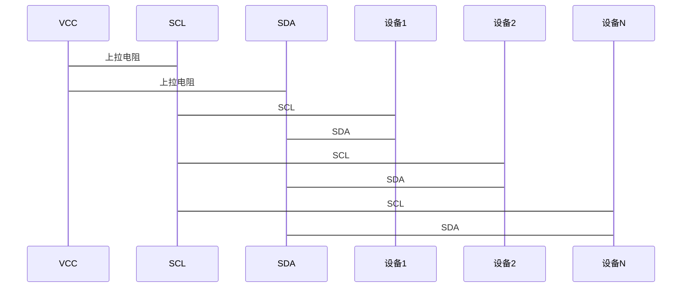
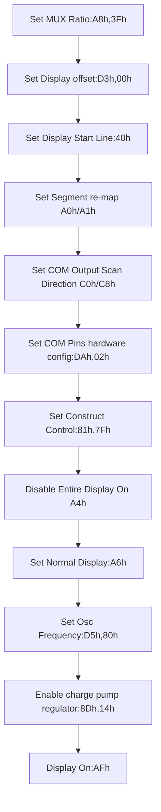

# I²C总线协议梳理附STM32平台I2C总线SSD1306OLED屏幕驱动

I²C也采用串行通信的思想；是一种简单的双向两线制的半双工总线协议，其引脚少，硬件实现简单，扩展性强，以I2C（之后均已I2C，IIC代指I²C，Inter-Integrated circuit）地址进行设备选择，相较SPI协议省去了片选线。I2C协议标准涉及OSI模型的物理层和数据链路层。

## 物理层

| 协议项         | 协议内容                                                     |
| -------------- | ------------------------------------------------------------ |
| 通信模式       | 半双工                                                       |
| 连接线电气特性 | 2根线：SDA（数据输入输出线），SCL（时钟信号线）              |
| 电平值         | 总线空闲时时钟线和数据线一般被链接电源的上拉电阻拉高，保持高电平。 |
| 速度           | 标准模式：100Kbit/s，快速模式400Kbit/s，高速模式3.4Mbit/s    |
| 主从模式       | 多主多从，通过设备i2c地址进行片选通信，7位i2c总线理论上限128个设备，但0x00地址为群呼地址不可用，所以实际总线挂载设备上限为127 |

硬件连接：



## 数据链路层

在数据链路层，由于不同设备的帧格式内容不同，I2C协议帧格式只是较为宽泛的标准：（一般是高位->低位）

| 信号     | 具体操作                                                     |
| -------- | ------------------------------------------------------------ |
| 起始信号 | SCL高电平时，SDA由高电平下拉                                 |
| 数据信号 | SCL低电平时SDA电平切换至所需发送的位电平信号（1为高电平，0为低电平），SCL切换至高电平即发送1bit信号 |
| 停止信号 | SCL高电平时，SDA由低电平通过上拉电阻自动上拉至高电平         |

SCL线和SDA线时序图：

[](https://imgse.com/i/pCQPBND)

之后笔者会以SSD1306为例进行帧格式的详细分析。

## SSD1306通信实例

首先引述SSD1306手册中对于iic总线模式下的数据格式描述

[](https://imgse.com/i/pCMzgGn)

>1. The master device initiates the data communication by a start condition. The definition of the start condition is shown in Figure 8-8. The start condition is established by pulling the SDA from HIGH to LOW while the SCL stays HIGH.
>2. The slave address is following the start condition for recognition use. For the SSD1306, the slave address is either “b0111100” or “b0111101” by changing the SA0 to LOW or HIGH (D/C pin acts as SA0).
>3. The write mode is established by setting the R/W# bit to logic “0”.
>4. An acknowledgement signal will be generated after receiving one byte of data, including the slave address and the R/W# bit. Please refer to the Figure 8-9 for the graphical representation of the acknowledge signal. The acknowledge bit is defined as the SDA line is pulled down during the HIGH period of the acknowledgement related clock pulse.
>5. After the transmission of the slave address, either the control byte or the data byte may be sent across the SDA. A control byte mainly consists of Co and D/C# bits following by six “0” ‘s.
>
>   * a. If the Co bit is set as logic “0”, the transmission of the following information will contain data bytes only.
>   * b. The D/C# bit determines the next data byte is acted as a command or a data. If the D/C# bit is set to logic “0”, it defines the following data byte as a command. If the D/C# bit is set to logic “1”, it defines the following data byte as a data which will be stored at the GDDRAM.The GDDRAM column address pointer will be increased by one automatically after each data write.
>6. Acknowledge bit will be generated after receiving each control byte or data byte.
>7. The write mode will be finished when a stop condition is applied. The stop condition is also defined in Figure 8-8. The stop condition is established by pulling the “SDA in” from LOW to HIGH while the “SCL” stays HIGH.
1. S是起始信号，即SCL高电平时，SDA从高电平拉低到低电平。
2. Slave Address为从机地址，在iic总线当中，所有设备都是通过iic设备地址进行片选操作的
3. RW#是读写位，读写是相对于主机而言的，不同于屏幕只需要写数据，一些设备例如传感器需要在主机发送命令后，从机返回采集到的数据给主机，这时读写位就会由之前发送命令的写变为接收采集数据的读。在ssd1306中：R/W#=1, 是读模式 R/W#=0, 是写模式。
4. ACK为应答位，即接收到一字节数据后从机生成的确认信号，在这个时钟周期内，主机的SDA端口会被上拉电阻自然拉成高电平，由输出模式变为输入模式，若成功拉低为低电平，那么意味着成功应答。

[](https://imgse.com/i/pCQPHvn)

5. Control byte在传输从机地址之后，ssd1306规定发送控制字节或者是数据字节，若之前未发送控制字节那么发送控制字节：

   * co位0意味着之后只发送数据字节（注意这里的数据字节可以是发送给ssd1306的命令也可以是发送给GDDRAM的屏幕显示量）。

   * D/C#位意味着之后发送的数据字节是发送给ssd1306的命令（即0）还是发送给GDDRAM的填充数据（即1）。

   * 剩余6位为“0”。


6. ACK应答位，同上。
7. Data byte数据字节，八位。当SCL高电位时，SDA高电平为1低电平为0，发送下一字节时需要将SCL电平拉低，SDA切换至下一位对应电平，切换完成后，将SCL恢复高电平。

[](https://imgse.com/i/pCQPaB6)

8. P是停止信号，SCL高电平时，SDA由低电平转为被上拉电阻拉起的高电平。

这时，我们发现实际iic的时钟周期完全取决于SCL线的主机高低电平操作，只要SCL高电平就能够发送SDA信号，时钟周期完全可以是不定长的，这一特性也为软件模拟iic通信做了铺垫。

### 软件模拟

#### SSD1306初始化

SSD1306需要输入一系列初始化命令才可以启动：



#### 核心代码

主函数核心代码：

```c
int main(void)
{
  ssd1306_i2c_init();
  while (1)
  {
    ssd1306_i2c_send_data_arr(1024);
  }
}
```

ssd1306显示驱动核心代码，这里SSD1306采用的是分页式内存管理，即128*8bit为1页：

```c
void delay_us(uint16_t delayusn){
    __HAL_TIM_SET_COUNTER(&htim1,0);
    __HAL_TIM_ENABLE(&htim1);
    while(__HAL_TIM_GET_COUNTER(&htim1)<delayusn){
        
    }
    __HAL_TIM_DISABLE(&htim1);
}

const unsigned char OLED_InitCmd[26]={
    0xAE,
    0x20,
    0x10,
    0xB0,
    0xC8,
    0x40,                              
    0x81,
    0x7F,
    0xA1,
    0xA6,
    0xA8,
    0x3F,
    0xA4,
    0xD3,
    0x00,
    0xD5,
    0xF0,
    0xD9,
    0x22,
    0xDA,
    0x12,
    0xDB,
    0x20,
    0x8D,
    0x14,
    0xAF,   
};

#define SDAOUT (GPIO_ChangeMode(GPIO_PIN_1,GPIO_MODE_OUTPUT_PP))
#define SDAIN (GPIO_ChangeMode(GPIO_PIN_1,GPIO_MODE_INPUT))
#define SCLH (HAL_GPIO_WritePin(GPIOC,GPIO_PIN_0,GPIO_PIN_SET))
#define SCLL (HAL_GPIO_WritePin(GPIOC,GPIO_PIN_0,GPIO_PIN_RESET))
#define SDAH (HAL_GPIO_WritePin(GPIOC,GPIO_PIN_1,GPIO_PIN_SET))
#define SDAL (HAL_GPIO_WritePin(GPIOC,GPIO_PIN_1,GPIO_PIN_RESET))
#define READSDA (HAL_GPIO_ReadPin(GPIOC,GPIO_PIN_1))
#define I2CDELAY (delay_us(1))

#define SSD1306_ADDRESS 0x78

void i2c_start(){
    SDAOUT;
    SDAH;
    SCLH;
    I2CDELAY;
    SDAL;
    I2CDELAY;
    SCLL;
}

void i2c_stop(){
    SDAOUT;
    SCLL;
    SDAL;
    I2CDELAY;
    SCLH;
    I2CDELAY;
    SDAH;
    I2CDELAY;
}

uint8_t i2c_tx_byte(uint8_t data){
    uint8_t bitcount;
    uint8_t ack=0;
    SDAOUT;
    for(bitcount=0;bitcount<8;bitcount++){
        SCLL;
        I2CDELAY;
        if(data&(1<<7)){
            SDAH;
        }
        else{
            SDAL;
        }
        SCLH;
        I2CDELAY;
        data=data<<1;
    }
    SCLL;
    SDAH;
    SDAIN;
    SCLH;
    if(READSDA){
        ack=1;
    }
    else{
        ack=0;
    }
    SCLL;
    return ack;
}

void ssd1306_i2c_init(){
    uint8_t cmdcount;
    i2c_start();
    i2c_tx_byte(SSD1306_ADDRESS);
    i2c_tx_byte(0x00);
    for(cmdcount=0;cmdcount<26;cmdcount++){
        i2c_tx_byte(OLED_InitCmd[cmdcount]);
    }
    i2c_stop();
}

void ssd1306_i2c_send_data_arr(uint32_t data_num){
    uint16_t count_send;
    i2c_start();
    i2c_tx_byte(SSD1306_ADDRESS);
    i2c_tx_byte(0x40);
    for(count_send=0;count_send<data_num;count_send++){
        i2c_tx_byte(0xFF);
    }
    i2c_stop();
}
```
