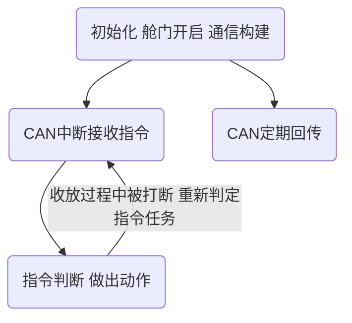

# 230828-0903

## 所学所做

### 25起落架

使用Free RTOS实现了通过CAN指令操作起落架舱门开关，起落架收放，转向舵机转向的功能，实现开舱门后再放起落架，放下起落架后才能转向；以及收起落架转向归零，再收起落架，最后关舱门的一整套逻辑；并实现了收放命令在收放过程打断后重新执行的功能。

* 通过使用RTOS提供的时间API，解决了上周框架中规定时间长度慢速控制舵机函数无法并发，循环阻塞任务的问题。

* 通过新建一个调度任务，能够快速响应CAN中断指令，快速删除并新建收放任务，从而达到在收放过程中可以被指令并重新判定并响应最新的动作指令。

* 程序简要框架（具体函数以及任务逻辑不涉及）：



* 更新了开发环境目前使用VScode+EIDE+openocd实现工程建立，代码编辑，编译烧写，debug。

### 58起落架

* 上周58起落架出现静态标定无问题，但动态刹车上限无法达到目标的情况，九月二日，于马兰基地再次与58所对这一情况进行研究，发现刹车线过长，刹车舵机行程在700左右（一圈为4096），经调整，将刹车线剪短，使刹车舵机行程在四百左右，刹车上限达到预期（从百分之百输出22牛米提升至33牛米，符合百分之百理论输出35牛米的预期，刹车性能提升%50），这与上周猜测刹车单位时间不够是相同的原理，即简单的：

$$
T=S/V
$$

* 另外，使用matlab的polyfit也可以进行刹车扭矩标定：

  示例代码：

  ```matlab
  %x主变量为舵机输出扭矩千分比
  x=[550;
      450;
      350;
      300;
      250;
      200];
  
  %y 因变量为输出刹车扭矩
  y=[25 23 24;
      20 20 20.5;
      12 15 14;
      9.1 9.6 9.7;
      7.5 5.8 6;
      2.5 2.4 1.4];
  
  y_avr=mean(y,2); %1意味着纵向求平均，2意味这横向求平均
  cur=polyfit(y_avr,x,1);
  f = polyval(cur,y_avr);
  
  plot(y_avr,x,'-o',y_avr,f,'--');
  legend('data average result','fitting result','Location','northwest');
  str=sprintf('y = %.5ex + %.5e',cur);
  text(y_avr(4),x(4),strcat('\leftarrow',str),'Fontsize',12);
  ```

  输出效果：

[](https://imgse.com/i/pPBV8Qs)

## 计划

1. 于0903进行58一号机的起落架动态调试，将此机动态效果也提升至预期，并对3号机进行标定。
2. 视出差进度进行25起落架项目的相关调整。