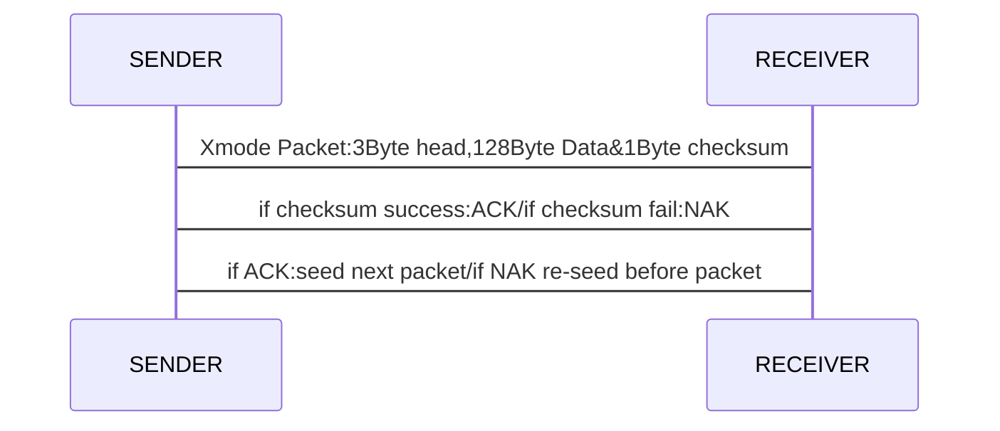
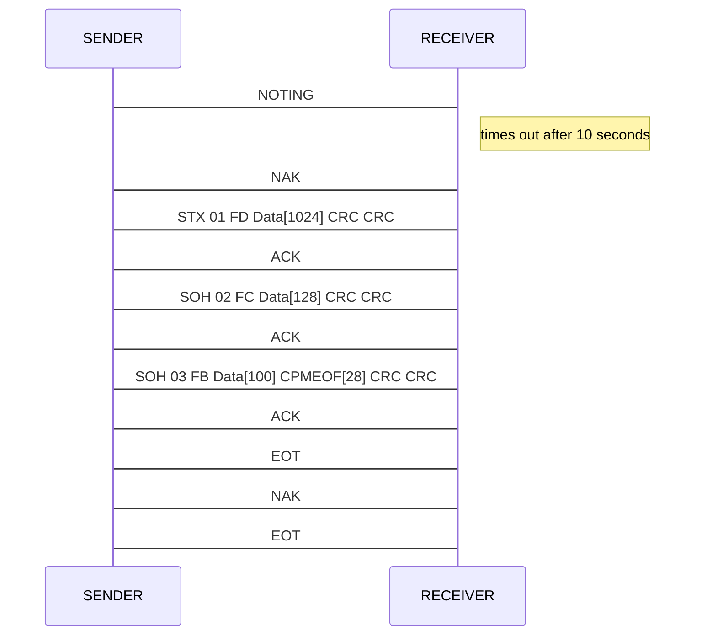

# 231030-1105~IAP-Ymodem协议部分

AN4657-STM32Cube_IAP_using_UART在数据链路层使用了UART，而应用层则使用了Ymodem协议。

## Xmodem→Ymodem

Ymodem诞生于1985年，脱胎于1977年的Xmodem，最初的Xmodem在原始的ASCII传输协议技术上引入了组包的概念，一包Xmodem为3Byte的包头（0x01协议头，包序号，包序号反码），128Byte数据字节，1Byte的校验和，校验成功接收方发ACK(0x06)，校验失败接收方发NAK(0x15)，发送方收到ACK会发送下一包，发送方收到NAK会重新发送上一包数据。

<center>Xmodem机制



### Ymodem在Xmode的基础上有以下方面提升:

| 提升方面      | 内容                                                         |
| ------------- | ------------------------------------------------------------ |
| 包大小        | 128Byte→1024Byte传输速度提升                                 |
| 校验方式      | 1Byte Checksum→16bit CRC                                     |
| 中止（Abort） | Xmodem在开始传输后无法打断停止，Ymodem引入CAN(0x18)中止关键字，在包发送后，由接收方发送。 |

## Ymodem

<center>Ymodem关键字与包格式

```c
 /* Ymodem Key Word */
#define SOH                     ((uint8_t)0x01)  /* start of 128-byte data packet */
#define STX                     ((uint8_t)0x02)  /* start of 1024-byte data packet */
#define EOT                     ((uint8_t)0x04)  /* end of transmission */
#define ACK                     ((uint8_t)0x06)  /* acknowledge */
#define NAK                     ((uint8_t)0x15)  /* negative acknowledge */
#define CA                      ((uint32_t)0x18) /* two of these in succession aborts transfer */
#define CRC16                   ((uint8_t)0x43)  /* 'C' == 0x43, request 16-bit CRC */
#define NEGATIVE_BYTE           ((uint8_t)0xFF)

#define ABORT1                  ((uint8_t)0x41)  /* 'A' == 0x41, abort by user */
#define ABORT2                  ((uint8_t)0x61)  /* 'a' == 0x61, abort by user */

#define NAK_TIMEOUT             ((uint32_t)0x100000)
#define DOWNLOAD_TIMEOUT        ((uint32_t)1000) /* One second retry delay */
#define MAX_ERRORS              ((uint32_t)5)

/* /-------- Packet in IAP memory ------------------------------------------\
 * | 0      |  1    |  2     |  3   |  4      | ... | n+4     | n+5  | n+6  | 
 * |------------------------------------------------------------------------|
 * | unused | start | number | !num | data[0] | ... | data[n] | crc0 | crc1 |
 * \------------------------------------------------------------------------/
 * the first byte is left unused for memory alignment reasons                 */
```

<CENTER>Ymodem机制




### AN4657的Ymodem源码解析

```c
static HAL_StatusTypeDef ReceivePacket(uint8_t *p_data, uint32_t *p_length, uint32_t timeout)
```

此函数主要功能是通过先接收包头这一帧判断包大小是SOH还是STX（128B/1KB）,再完整接收整个包：

```c
 if (status == HAL_OK)
  {
    switch (char1)
    {
      case SOH:
        packet_size = PACKET_SIZE;
        break;
      case STX:
        packet_size = PACKET_1K_SIZE;
        break;
      case EOT:
        break;
      case CA:
        if ((HAL_UART_Receive(&UartHandle, &char1, 1, timeout) == HAL_OK) && (char1 == CA))
        {
          packet_size = 2;
        }
        else
        {
          status = HAL_ERROR;
        }
        break;
      case ABORT1:
      case ABORT2:
        status = HAL_BUSY;
        break;
      default:
        status = HAL_ERROR;
        break;
    }
    *p_data = char1;

    if (packet_size >= PACKET_SIZE )
    {
      status = HAL_UART_Receive(&UartHandle, &p_data[PACKET_NUMBER_INDEX], packet_size + PACKET_OVERHEAD_SIZE, timeout);
```

并先对包的序号和序号反码进行校验，再对包CRC校验：

```c
/* Simple packet sanity check */
if (p_data[PACKET_NUMBER_INDEX] != ((p_data[PACKET_CNUMBER_INDEX]) ^ NEGATIVE_BYTE))//NEGATIVE_BYTE:0xFF
{
    packet_size = 0;
    status = HAL_ERROR;
}
else
{
    /* Check packet CRC */
    /*先获取包中的CRC数值*/
    crc = p_data[ packet_size + PACKET_DATA_INDEX ] << 8;
    crc += p_data[ packet_size + PACKET_DATA_INDEX + 1 ];
    /*再计算CRC*/
    if (Cal_CRC16(&p_data[PACKET_DATA_INDEX], packet_size) != crc )
    {
        packet_size = 0;
        status = HAL_ERROR;
    }
}
```

### CRC-16 CCITT

CRC校验本质上是选取一个合适的除数，要进行校验的数据是被除数，然后做模2除法（也就是被除数和除数异或），得到的余数就是CRC校验值。

而CRC-16 CCITT的合适除数多项式为：（这是标准，至于为何选择这一多项式是考虑了更好的检测性能，设计生成多项式涉及primitive polynomial (field theory)等场论纯数学理论）
$$
x^{16}+x^{12}+x^5+1
$$
即b1 0001 0000 0010 0001忽略掉第16位，可记为0x1021。

这里CCITT以"A"的ascii码作为例子进行了CRC16CCITT标准的校验：

>```
>Calculation of the 16-bit CRC-CCITT for a one-byte message consisting of the letter “A”:
>             Quotient= 111100001110111101011001`
>`   poly=    ------------------------------------------`
>`10001000000100001 ) 1111111111111111**01000001**0000000000000000`
>`          10001000000100001`
>`          -----------------    
>`           11101111110111111   
>`           10001000000100001 
>`           -----------------`
>`           11001111100111100`
>`           10001000000100001`
>`           -----------------`
>`            10001111000111010`
>`            10001000000100001`
>`            -----------------`
>`            00001110000110110`
>`            00000000000000000`
>`            -----------------`
>`             00011100001101100`
>`             00000000000000000`
>`             -----------------`
>`             00111000011011000`
>`             00000000000000000`
>`             -----------------`
>`              01110000110110001`
>`              00000000000000000`
>`              -----------------`
>`              11100001101100010`
>`              10001000000100001`
>`              -----------------`
>`               11010011010000110`
>`               10001000000100001`
>`               -----------------`
>`               10110110101001110`
>`               10001000000100001`
>`               -----------------`
>`                01111101011011110`
>`                00000000000000000`
>`                -----------------`
>`                11111010110111100`
>`                10001000000100001`
>`                -----------------`
>`                 11100101100111010`
>`                 10001000000100001`
>`                 -----------------`
>`                 11011011000110110`
>`                 10001000000100001`
>`                 -----------------`
>`                  10100110000101110`
>`                  10001000000100001`
>`                  -----------------`
>`                  01011100000011110`
>`                  00000000000000000`
>`                  -----------------`
>`                   10111000000111100`
>`                   10001000000100001`
>`                   -----------------`
>`                   01100000000111010`
>`                   00000000000000000`
>`                   -----------------`
>`                    11000000001110100`
>`                    10001000000100001`
>`                    -----------------`
>`                    10010000010101010`
>`                    10001000000100001`
>`                    -----------------`
>`                     00110000100010110`
>`                     00000000000000000`
>`                     -----------------`
>`                     01100001000101100`
>`                     00000000000000000`
>`                     -----------------`
>`                      11000010001011000`
>`                      10001000000100001`
>`                      -----------------`
>`                      1001010001111001 = CRC
>```

YAM的CRC校验逻辑：

```c
/* update CRC */
unsigned short
updcrc(c, crc)
register c;
register unsigned crc;
{
	register count;
	for (count=8; --count>=0;) {
		if (crc & 0x8000) {
			crc <<= 1;
			crc += (((c<<=1) & 0400) != 0);
			crc ^= 0x1021;
		}
		else {
			crc <<= 1;
			crc += (((c<<=1) & 0400) != 0);
		}
	}
	return crc;
}
```

AN4657中的CRC校验：

```c
/**
  * @brief  Update CRC16 for input byte
  * @param  crc_in input value 
  * @param  input byte
  * @retval None
  */
uint16_t UpdateCRC16(uint16_t crc_in, uint8_t byte)
{
  uint32_t crc = crc_in;
  uint32_t in = byte | 0x100; //在bit8位或，实际已经超过byte变量

  do
  {
    crc <<= 1; //二者左移，对应竖式中的向后除
    in <<= 1;  //二者左移，对应竖式中的向后除
    if(in & 0x100) //in一直左移，实际是对每一次的除数
      ++crc; 		//如果不够除那么CRC+1
    if(crc & 0x10000)
      crc ^= 0x1021;//得到这一次模二除的余数
  }
  
  while(!(in & 0x10000));

  return crc & 0xffffu;
}

/**
  * @brief  Cal CRC16 for YModem Packet
  * @param  data
  * @param  length
  * @retval None
  */
uint16_t Cal_CRC16(const uint8_t* p_data, uint32_t size)
{
  uint32_t crc = 0;
  const uint8_t* dataEnd = p_data+size;

  while(p_data < dataEnd)
    crc = UpdateCRC16(crc, *p_data++);
 
  crc = UpdateCRC16(crc, 0);
  crc = UpdateCRC16(crc, 0);

  return crc&0xffffu;
}
```

AN4657中Cal_CRC16实际是对每个字节进行CRC计算后得出的校验和，算法核心在于UpdateCRC16的以0x1021为除数的模二除法，解释已在注释中说明。
