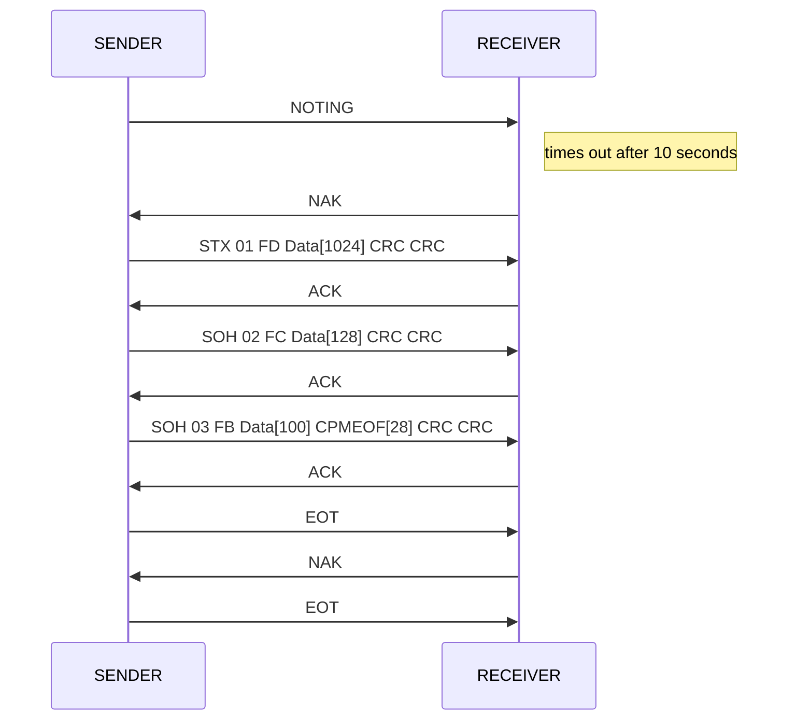

# Ymodem 应答机制实现



```c
#define SOH                     ((uint8_t)0x01)  /* start of 128-byte data packet */
#define STX                     ((uint8_t)0x02)  /* start of 1024-byte data packet */
#define EOT                     ((uint8_t)0x04)  /* end of transmission */
#define ACK                     ((uint8_t)0x06)  /* acknowledge */
#define NAK                     ((uint8_t)0x15)  /* negative acknowledge */
#define CA                      ((uint32_t)0x18) /* two of these in succession aborts transfer */
#define CRC16                   ((uint8_t)0x43)  /* 'C' == 0x43, request 16-bit CRC */
#define NEGATIVE_BYTE           ((uint8_t)0xFF)

#define ABORT1                  ((uint8_t)0x41)  /* 'A' == 0x41, abort by user */
#define ABORT2                  ((uint8_t)0x61)  /* 'a' == 0x61, abort by user */

#define NAK_TIMEOUT             ((uint32_t)0x100000)
#define DOWNLOAD_TIMEOUT        ((uint32_t)1000) /* One second retry delay */
#define MAX_ERRORS              ((uint32_t)5)

COM_StatusTypeDef Ymodem_Receive ( uint32_t *p_size )
{
  uint32_t i, packet_length, session_done = 0, file_done, errors = 0, session_begin = 0;
  uint32_t flashdestination, ramsource, filesize;
  uint8_t *file_ptr;
  uint8_t file_size[FILE_SIZE_LENGTH], tmp, packets_received;
  COM_StatusTypeDef result = COM_OK;

  /* Initialize flashdestination variable */
  flashdestination = APPLICATION_ADDRESS;

  while ((session_done == 0) && (result == COM_OK))
  {
    packets_received = 0;
    file_done = 0;
    while ((file_done == 0) && (result == COM_OK))
    {
      switch (ReceivePacket(aPacketData, &packet_length, DOWNLOAD_TIMEOUT))
      {
        case HAL_OK:
          errors = 0;
          switch (packet_length)
          {
            case 2:
              /* Abort by sender */
              Serial_PutByte(ACK);
              result = COM_ABORT;
              break;
            case 0:
              /* End of transmission */
              Serial_PutByte(ACK);
              file_done = 1;
              break;
            default:
              /* Normal packet */
              if (aPacketData[PACKET_NUMBER_INDEX] != packets_received)
              {
                Serial_PutByte(NAK);
              }
              else
              {
                if (packets_received == 0)
                {
                  /* File name packet */
                  if (aPacketData[PACKET_DATA_INDEX] != 0)
                  {
                    /* File name extraction */
                    i = 0;
                    file_ptr = aPacketData + PACKET_DATA_INDEX;

                    /* Test the size of the image to be sent */
                    /* Image size is greater than Flash size */
                    if (*p_size > (USER_FLASH_SIZE + 1))
                    {
                      /* End session */
                      tmp = CA;
                      HAL_UART_Transmit(&UartHandle, &tmp, 1, NAK_TIMEOUT);
                      HAL_UART_Transmit(&UartHandle, &tmp, 1, NAK_TIMEOUT);
                      result = COM_LIMIT;
                    }
                    /* erase user application area */
                    Flash_Erase();
                    *p_size = filesize;

                    Serial_PutByte(ACK);
                    Serial_PutByte(CRC16);
                  }
                  /* File header packet is empty, end session */
                  else
                  {
                    Serial_PutByte(ACK);
                    file_done = 1;
                    session_done = 1;
                    break;
                  }
                }
                else /* Data packet */
                {
                  ramsource = (uint32_t) & aPacketData[PACKET_DATA_INDEX];

                  /* Write received data in Flash */
                  if (Flash_Write((uint32_t*) ramsource, packet_length/4) == FLASHIF_OK)                   
                  {
                    flashdestination += packet_length;
                    Serial_PutByte(ACK);
                  }
                  else /* An error occurred while writing to Flash memory */
                  {
                    /* End session */
                    Serial_PutByte(CA);
                    Serial_PutByte(CA);
                    result = COM_DATA;
                  }
                }
                packets_received ++;
                session_begin = 1;
              }
              break;
          }
          break;
        case HAL_BUSY: /* Abort actually */
          Serial_PutByte(CA);
          Serial_PutByte(CA);
          result = COM_ABORT;
          break;
        default:
          if (session_begin > 0)
          {
            errors ++;
          }
          if (errors > MAX_ERRORS)
          {
            /* Abort communication */
            Serial_PutByte(CA);
            Serial_PutByte(CA);
          }
          else
          {
            Serial_PutByte(CRC16); /* Ask for a packet */
          }
          break;
      }
    }
  }
  return result;
}
```

