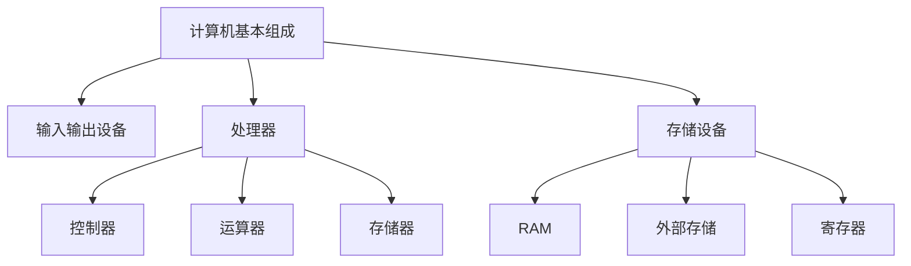
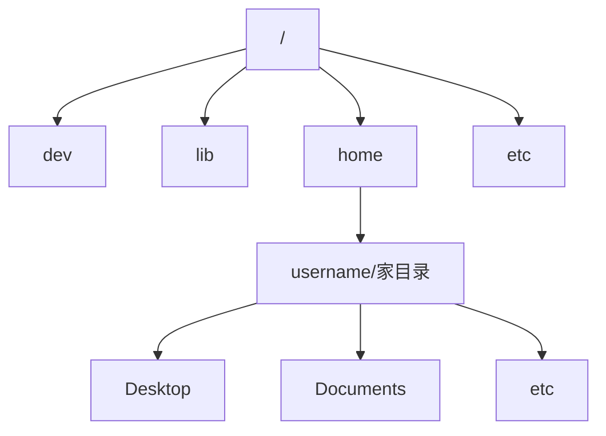
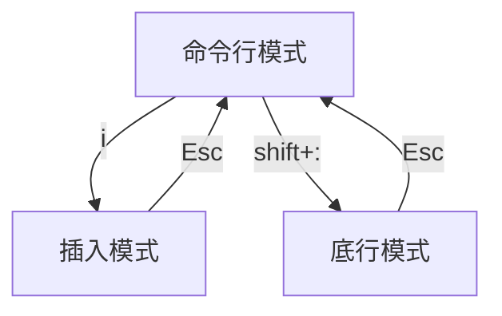

# 【周报】230130-0205.1~计算机基础知识与Linux系统入门

## 计算机基础知识

### 计算机基本组成



RAM：速度快容量小断电易失性。
外部存储：速度慢容量大断电保持。

### 计算机程序

程序时计算机能够识别的一组有序指令。程序设计步骤通常为编辑原码，编译程序，执行程序。

### 计算机数据

计算机数据按数值分为数值数据和非数值数据两种。

非数值数据一般为：字符，图片，声音等，编码后以二进制文件保存。

例如字符在计算机中最早就以Ascii码（8bit/1byte）的形式保存在计算机中。比如‘A’为十进制的65，'a'为十进制的97，‘0’为十进制的48。

#### 进制转换

##### 其他进制转十进制：（对应的数字乘以其他进制的位数次幂）

二进制转换为十进制：  1011----> 1 * 2^0 + 1 * 2^1 + 0 * 2^2 + 1 * 2^3

八进制转换为十进制：  076-----> 6 * 8^0 + 7 * 8^1

十六进制转换为十进制：0xafc--->12 * 16^0 + 15 * 16^1 + 10 * 16^2
  
##### 十进制转其他进制： (除以其他进制倒取余数)

十进制转换为二进制(除2倒取余)：34------->0010  0010

十进制转换为八进制(除8倒取余)：34------->042

十进制转换为十六进制(除16倒取余)：34------->0x22

##### 二进制，八进制，十六进制的关系

一位八进制可以表示成三位二进制，而一位十六进制可以表示为四位二进制。

#### 基本数据类型

各数据类型及其所占空间：
|类型|关键字|Byte|
|----|----|----|
|字符型|char|1|
|整型|short|2|
|整型|int|4|
|整型|long（32bit OS）|4|
|整型|long（64bit OS）|8|
|浮点型|float|4|
|浮点型|double|8|

##### 原码、反码、补码

数值数据在计算机中以二进制进行存储，为了解决二进制没有负数，正数负数二进制相加不为0的问题。所以计算机全部以补码形式存储。其中第一位为符号位，正数为0，负数为1。

正数的原码、反码、补码都是一样的。

负数的反码符号位不变，数据位按位取反（1↔0），补码是反码+1。

例子：以带符号字符数据的十进制-10为例：
|类型|二进制数|
|----|----|
|原码|1000 1010|
|反码|1111 0101|
|补码|1111 0110|

而十进制10补码与原码相同为0000 1010，所以二进制-10和10相加为下：
0000 1010+1111 0110=1 0000 0000。最高位舍去则为0000 0000。

##### 值域范围

|数据类型|二进制进制值域范围|十进制值域范围
|----|----|----
|unsigned char|0000 0000至1111 1111|0至255
|signed char|（1/0符号位）000 0000至（1/0符号位）111 1111|-128至127
|unsigned int|0000 0000 0000 0000 0000 0000 0000 0000至1111 1111 1111 1111 1111 1111 1111 1111|0至（2\^32）-1
|signed int|（1/0符号位）000 0000 0000 0000 0000 0000 0000 0000至（1/0符号位）111 1111 1111 1111 1111 1111 1111 1111|-（2\^31）至(2\^31)-1
|float|1bit符号位，8bit二进制指数，23bit尾数|准确表示6-7位有效数字|
|double|1bit符号位，11bit指数，52bit尾数|准确表示15-16位有效数字|

注：有效数字指小数点前小数点后能够准确表示的的十进制位数。

## Linux系统入门

### Linux目录结构

Linux与Windows以盘符开始的目录结构不同，Linux目录结构是以根目录为起源的树状结构。  



### Linux常用命令

打开终端：使用crtl+alt+T在家目录下打开，crtl+shift+N在当前操作路径下新建终端窗口。
```shell
username:~/Desktop $
``` 
用户名：当前操作路径\$。"\$"是普通用户“\#”是超级用户。

显示当前目录

```shell
pwd
```

显示当前路径下的文件

```shell
ls
ls -l//显示当前路径下文件以及属性
ls -a//显示当前路径下所有文件包括.开头的隐藏文件
```

到达路径

```shell
cd          //到家目录
cd ..       //返回上一级目录
cd 绝对路径 
cd -        //返回上一操作目录
```

创建

```shell
touch 文件名 目标路径
mkdir 文件夹名 目标路径
```

删除

```shell
rm
rm -r   //递归删除文件夹
rmdir   //删除空文件夹
```

移动/复制

```shell
cp 文件名 目标路径
mv 文件名 目标路径
```

超级用户（super user）：可操作家目录以上的路径

```shell
sudo \\以超级用户执行一次命令
su   \\进入超级用户
```

#### Linux文件操作命令行示例

```shell
username:/mnt/hgfs/vm_share$ cd
username:~$ ls
Desktop    Downloads  Pictures  snap       Videos
Documents  Music      Public    Templates
username:~$ cd Desktop/
username:~/Desktop$ touch 1.c 2.c 3.c
username:~/Desktop$ ls
1.c  2.c  3.c
username:~/Desktop$ cp 1.c ..
username:~/Desktop$ cp 2.c /home/username
username:~/Desktop$ cd ..
username:~$ ls
1.c  Desktop    Downloads  Pictures  snap       Videos
2.c  Documents  Music      Public    Templates
username:~$ mv 1.c Desktop
username:~$ mv 2.c /home/username/Desktop
username:~$ cd Desktop/
username:~/Desktop$ ls
1.c  2.c  3.c
username:~/Desktop$ mkdir source
username:~/Desktop$ mv 1.c source 2.c source 3.c source
username:~/Desktop$ ls 
source
username:~/Desktop$ cd source/
username:~/Desktop/source$ ls
1.c  2.c  3.c
username:~/Desktop/source$ rm 1.c
username:~/Desktop/source$ cd ..
username:~/Desktop$ rm -r source
username:~/Desktop$ ls
username:~/Desktop$ 
```

### Vim编辑器

打开编辑器

```shell
vim 文件名
```

#### Vim三种模式

##### 底行模式

```shell
w           //保存
q           //退出
wq          //保存并推出
q!          //强制退出
wq!         //保存并强制退出
set nu      //显示行号
set nonu    //取消显示行号
```

##### 命令行模式

```shell
yy      //复制
dd      //剪切
p       //粘贴
nyy     //复制n行
ndd     //删除n行
u       //撤销
crtl+t  //反撤销
```

##### 三种模式的关系



#### gcc编译器

```shell
gcc 原码文件 //默认输出a.out
gcc 原码文件 -o 自定义编译程序名
```
