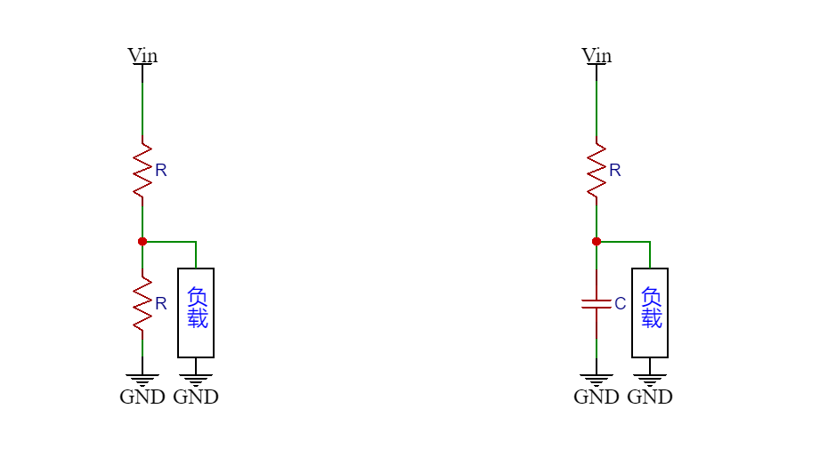
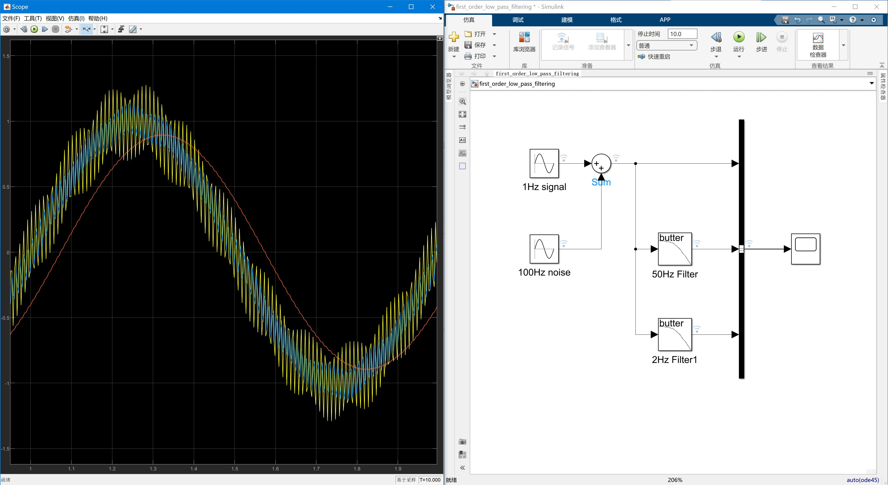

# 滤波算法（一）一阶低通滤波器截止频率与相位延迟设计&算法实现

## 模型搭建

### 物理模型

一阶低通滤波器的物理模型来源于一阶RC滤波器,其输出信号与电容的容抗和电阻的阻抗形成的电路网络有关，此电路网络是由电阻分压网络衍生而来。

分压电路输出信号如下：
$$
Vout=Vin\frac{R2}{R1+R2}
$$
RC滤波电路输出信号如下：
$$
\begin{align*}
Vout&=Vin\frac{Xc}{\sqrt{R^2+Xc^2}}\\
    &=\frac{\frac{1}{\omega C}}{\sqrt{(\frac{1}{\omega C})^2+R^2}}\\
\end{align*}
$$

### 传递函数

一阶低通滤波器传递函数即（这里的$j\omega$不同于之上的$\omega$,$j\omega$是虚数）：
$$
\begin{align*}
F(s)&=\frac{Vout(jw)}{Vin(jw)}\\
    &=\frac{Xc}{R+Xc}\\
    &=\frac{\frac{1}{j\omega C}}{\frac{1}{j\omega C}+R}\\
    &=\frac{1}{1+sRC}\\
\end{align*}
$$

实际结果就是一阶低通滤波器在系统分析上为一个一阶惯性环节。

### Simulink波形仿真



## 参数原理

### 截止频率

在3dB带宽系统中（即半功率系统），信号幅值增益为-3dB（$20\log(0.7079)\approx-3dB$）时的频率为滤波器的截止频率。那么此时输出信号$Vout\approx0.7079Vin$

那么根据RC滤波器输出信号公式且$\omega=2\pi f$可得截止频率
$$
\begin{align*}
0.7079Vin&\approx Vin\frac{Xc}{\sqrt{R^2+Xc^2}}\\
0.7079&\approx\frac{\frac{1}{\omega C}}{\sqrt{(\frac{1}{\omega C})^2+R^2}}\\
0.7079^2&\approx\frac{(\frac{1}{\omega C})^2}{(\frac{1}{\omega C})^2+R^2}\\
(\frac{1}{\omega C})^2&\approx\frac{0.7079^2}{1-0.7079^2}R^2\\
{\omega}&\approx\frac{1}{\sqrt{\frac{0.7079^2}{1-0.7079^2}}RC}\\
f_c&\approx\frac{1}{2\pi RC}\\
\end{align*}
$$

### 相位延迟

（待完善）
$$
\varphi=-arctan(2\pi fRC)
$$

## 算法实现

### 滤波器离散化


### C语言实现

```c
#define LOW_PASS_FILTERING_ALPHA 0.4f //1~0

typedef struct {
    float value_current;
    float value_last;
} FOLPF_DATATypeDef;

void FLOAT_FirstOrderLowPassFiltering_Process(FOLPF_DATATypeDef *data_pointer){
    data_pointer->value_current=((1-LOW_PASS_FILTERING_ALPHA)*data_pointer->value_last)
    +(LOW_PASS_FILTERING_ALPHA *data_pointer->value_current);
    data_pointer->value_last=data_pointer->value_current;
}

```
