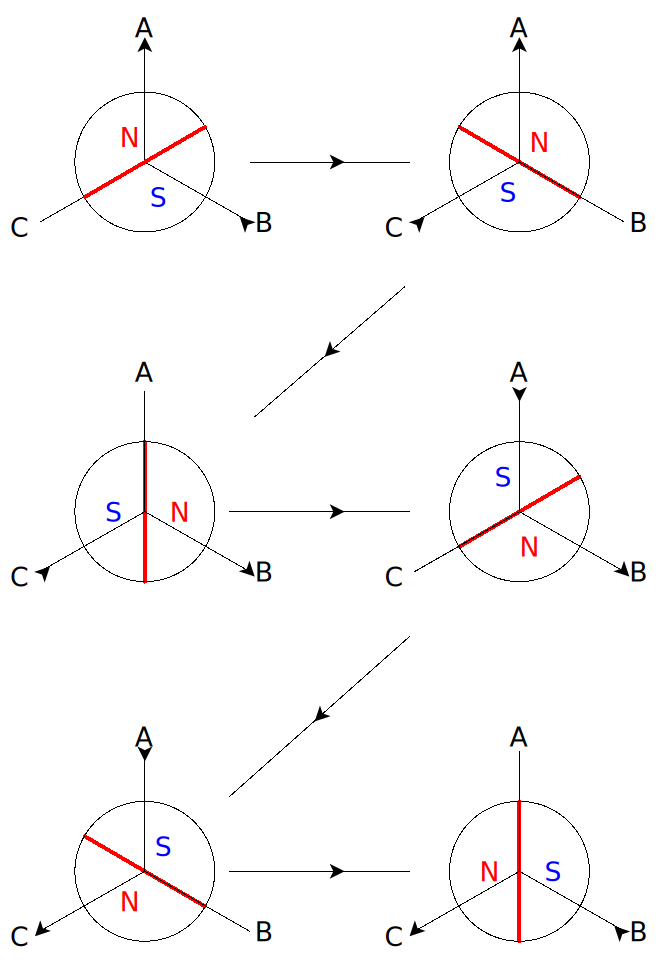
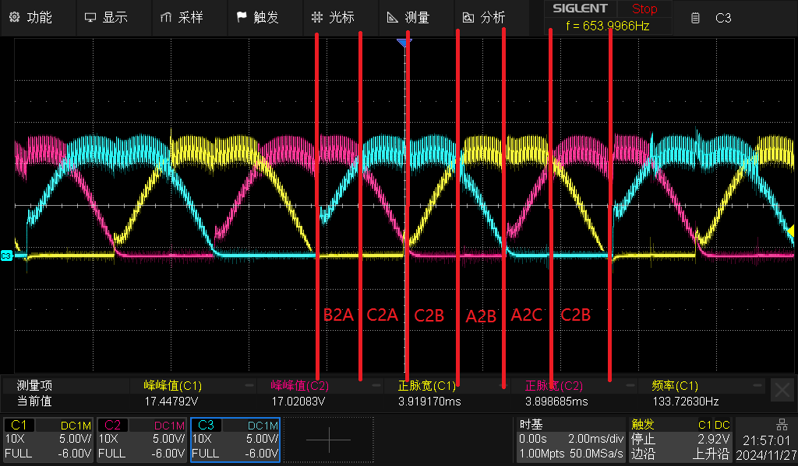
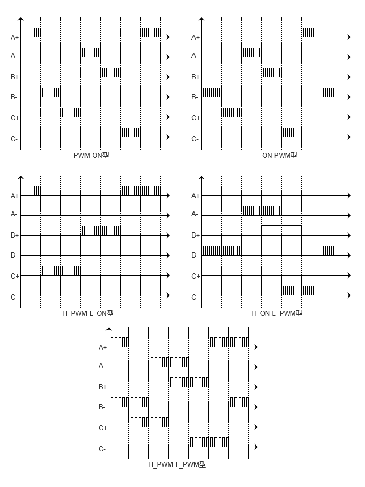
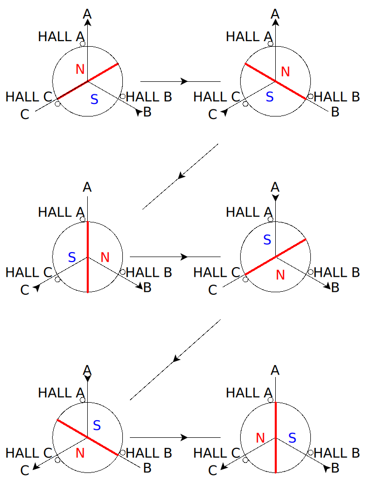
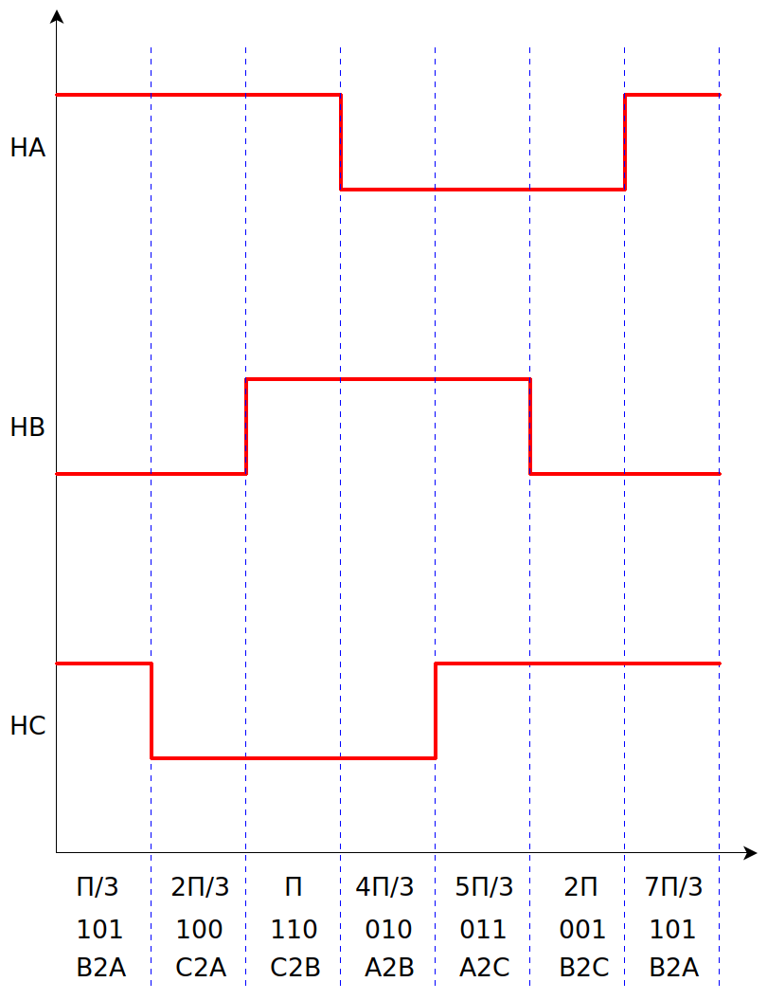
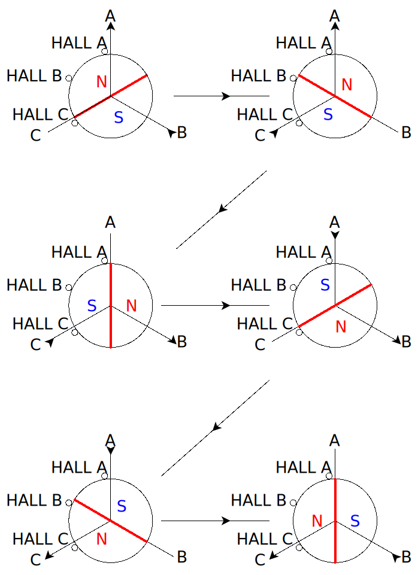
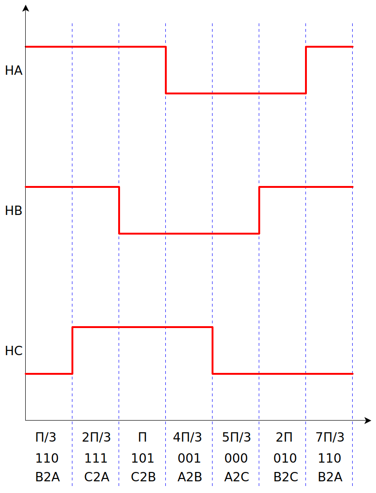

# 直流无刷电机控制（一）六步换相与霍尔换相闭环

## 直流无刷电机概述

直流无刷电机的转子为永磁铁，定子为换相线圈，有别于有刷电机通过电刷或者换向器换相，无刷电机通过控制器电子换相。

### 极对数

直流无刷电机采用永磁铁作为转子，一对NS磁极为一极对，为了使电机运转更加平滑，一般转子配有四极对或八极对的多极对。

### 槽数

直流无刷电机槽数一般指定子上的绕组线圈数，电机的线圈绕组通过嵌线工艺固定在定子槽中。因为直流无刷电机为三相电机，所以槽数一般为：

$$
槽数=3N
$$

### 机械角度和电角度

机械角度为电机转子轴相对于定子旋转的角度；而电机中一个观测点磁极发生由N变化至S（亦或者由S变化至N）则记为电角度旋转180°。

所以可得：

$$
电角度=机械角度 \times 极对数
$$

### 定子磁场

可以通过右手螺旋定则确定定子线圈通电后产生的电磁场极性。

## 六步换相

六步换相是一种控制直流无刷电机的换相方法，通过控制定子中的电流，以实现电机转速和旋转方向上的控制。

六步换相有120°两相定子导通和180°三相定子导通两种导通模式，这里讨论的是更多场景下使用的120°导通模式。

下图定子磁场极性由右手螺旋定则确定。



六步换相并不是说必须有传感器估算电角度，只需要按照下述顺序（或反顺序）进行换相，在调制参数合适的情况下电机就有可能运转，区别只是在于运转的平滑性，带载丢步的概率或者说换相的成功概率。

为了提高电机换相的成功率，尤其是为了改善带载状态下的丢步问题，并使运转更加平滑，需要对电机转子电角度观测进行闭环换相（注意这里指的是换相闭环，并非电机控制中常见的电流环，速度环或位置环那样的控制器闭环）。

### 六步换向实际测量图示

如下图示CH1黄色为A,CH2粉色为B,CH3蓝色为C。测量结果为各相反电动势。



## 调制方法

电机PWM调制方法实则为功率器件桥臂开关策略。分为以下五种：

1. PWM-ON型。在120°导通区间，各开关管前60°采用PWM调制，后60°则恒通。
2. ON-PWM型。在120°导通区间，各开关管前60°恒通，后60°则采用PWM调制。
3. H_PWM-L_ON型。在120°导通区间，上桥臂开关管采用PWM调制，下桥臂恒通。
4. H_ON-L_PWM型。在120°导通区间，上桥臂开关管恒通，下桥臂采用PWM调制。
5. H_PWM-L_PWM型。在120°导通区间，上、下桥臂均采用PWM调制。



下为采用H_PWM-L_PWM开关策略的换相代码

```c
switch (phase)
    {
    case HALL_PHASE_B2A:{
        LL_TIM_CC_DisableChannel(TIMx,LL_TIM_CHANNEL_CH1);
        LL_TIM_CC_DisableChannel(TIMx,LL_TIM_CHANNEL_CH2N);
        LL_TIM_CC_DisableChannel(TIMx,LL_TIM_CHANNEL_CH3);
        LL_TIM_CC_DisableChannel(TIMx,LL_TIM_CHANNEL_CH3N);

        LL_TIM_DisableAllOutputs(TIMx);
        LL_TIM_DisableCounter(TIMx);
        

        LL_TIM_OC_SetCompareCH2(TIMx,global_pwm_duty);
        LL_TIM_OC_SetCompareCH1(TIMx,TIMx->ARR);

        LL_TIM_CC_EnableChannel(TIMx,LL_TIM_CHANNEL_CH2);
        LL_TIM_CC_EnableChannel(TIMx,LL_TIM_CHANNEL_CH1N);

        LL_TIM_EnableAllOutputs(TIMx);
        LL_TIM_EnableCounter(TIMx);

        break;
    }
    case HALL_PHASE_C2A:{
        LL_TIM_CC_DisableChannel(TIMx,LL_TIM_CHANNEL_CH1);
        LL_TIM_CC_DisableChannel(TIMx,LL_TIM_CHANNEL_CH2);
        LL_TIM_CC_DisableChannel(TIMx,LL_TIM_CHANNEL_CH2N);
        LL_TIM_CC_DisableChannel(TIMx,LL_TIM_CHANNEL_CH3N);
        
        LL_TIM_DisableAllOutputs(TIMx);
        LL_TIM_DisableCounter(TIMx);
        

        LL_TIM_OC_SetCompareCH3(TIMx,global_pwm_duty);
        LL_TIM_OC_SetCompareCH1(TIMx,TIMx->ARR);

        LL_TIM_CC_EnableChannel(TIMx,LL_TIM_CHANNEL_CH3);
        LL_TIM_CC_EnableChannel(TIMx,LL_TIM_CHANNEL_CH1N);

        LL_TIM_EnableAllOutputs(TIMx);
        LL_TIM_EnableCounter(TIMx);

        break;
    }
    case HALL_PHASE_C2B:{
        LL_TIM_CC_DisableChannel(TIMx,LL_TIM_CHANNEL_CH1);
        LL_TIM_CC_DisableChannel(TIMx,LL_TIM_CHANNEL_CH1N);
        LL_TIM_CC_DisableChannel(TIMx,LL_TIM_CHANNEL_CH2);
        LL_TIM_CC_DisableChannel(TIMx,LL_TIM_CHANNEL_CH3N);
        
        LL_TIM_DisableAllOutputs(TIMx);
        LL_TIM_DisableCounter(TIMx);
        

        LL_TIM_OC_SetCompareCH3(TIMx,global_pwm_duty);
        LL_TIM_OC_SetCompareCH2(TIMx,TIMx->ARR);

        LL_TIM_CC_EnableChannel(TIMx,LL_TIM_CHANNEL_CH3);
        LL_TIM_CC_EnableChannel(TIMx,LL_TIM_CHANNEL_CH2N);

        LL_TIM_EnableAllOutputs(TIMx);
        LL_TIM_EnableCounter(TIMx);

        break;
    }
    case HALL_PHASE_A2B:{
        LL_TIM_CC_DisableChannel(TIMx,LL_TIM_CHANNEL_CH1N);
        LL_TIM_CC_DisableChannel(TIMx,LL_TIM_CHANNEL_CH2);
        LL_TIM_CC_DisableChannel(TIMx,LL_TIM_CHANNEL_CH3);
        LL_TIM_CC_DisableChannel(TIMx,LL_TIM_CHANNEL_CH3N);
        
        LL_TIM_DisableAllOutputs(TIMx);
        LL_TIM_DisableCounter(TIMx);
        

        LL_TIM_OC_SetCompareCH1(TIMx,global_pwm_duty);
        LL_TIM_OC_SetCompareCH2(TIMx,TIMx->ARR);

        LL_TIM_CC_EnableChannel(TIMx,LL_TIM_CHANNEL_CH1);
        LL_TIM_CC_EnableChannel(TIMx,LL_TIM_CHANNEL_CH2N);

        LL_TIM_EnableAllOutputs(TIMx);
        LL_TIM_EnableCounter(TIMx);

        break;
    }
    case HALL_PHASE_A2C:{
        LL_TIM_CC_DisableChannel(TIMx,LL_TIM_CHANNEL_CH1N);
        LL_TIM_CC_DisableChannel(TIMx,LL_TIM_CHANNEL_CH2);
        LL_TIM_CC_DisableChannel(TIMx,LL_TIM_CHANNEL_CH2N);
        LL_TIM_CC_DisableChannel(TIMx,LL_TIM_CHANNEL_CH3);
        
        LL_TIM_DisableAllOutputs(TIMx);
        LL_TIM_DisableCounter(TIMx);
        

        LL_TIM_OC_SetCompareCH1(TIMx,global_pwm_duty);
        LL_TIM_OC_SetCompareCH3(TIMx,TIMx->ARR);

        LL_TIM_CC_EnableChannel(TIMx,LL_TIM_CHANNEL_CH1);
        LL_TIM_CC_EnableChannel(TIMx,LL_TIM_CHANNEL_CH3N);

        LL_TIM_EnableAllOutputs(TIMx);
        LL_TIM_EnableCounter(TIMx);

        break;
    }
    case HALL_PHASE_B2C:{
        LL_TIM_CC_DisableChannel(TIMx,LL_TIM_CHANNEL_CH1);
        LL_TIM_CC_DisableChannel(TIMx,LL_TIM_CHANNEL_CH1N);
        LL_TIM_CC_DisableChannel(TIMx,LL_TIM_CHANNEL_CH2N);
        LL_TIM_CC_DisableChannel(TIMx,LL_TIM_CHANNEL_CH3);

        
        LL_TIM_DisableAllOutputs(TIMx);
        LL_TIM_DisableCounter(TIMx);
        

        LL_TIM_OC_SetCompareCH2(TIMx,global_pwm_duty);
        LL_TIM_OC_SetCompareCH3(TIMx,TIMx->ARR);

        LL_TIM_CC_EnableChannel(TIMx,LL_TIM_CHANNEL_CH2);
        LL_TIM_CC_EnableChannel(TIMx,LL_TIM_CHANNEL_CH3N);

        LL_TIM_EnableAllOutputs(TIMx);
        LL_TIM_EnableCounter(TIMx);

        break;
    }
    default:
        break;
}
```

## 霍尔传感器

电机中的霍尔传感器为单极性霍尔传感器，即在靠近N磁极时表现为高电平，在靠近S磁极表现为低电平。

直流无刷电机的霍尔传感器布置方式为120°和60°两种，对应着两种控制序列。

### 120°布置



因为120°布置，所以传感器ABC之间有着$\frac{4\pi}{3}$的相位差



### 60°布置



因为60°布置，所以传感器ABC之间有着$\frac{2\pi}{3}$的相位差


