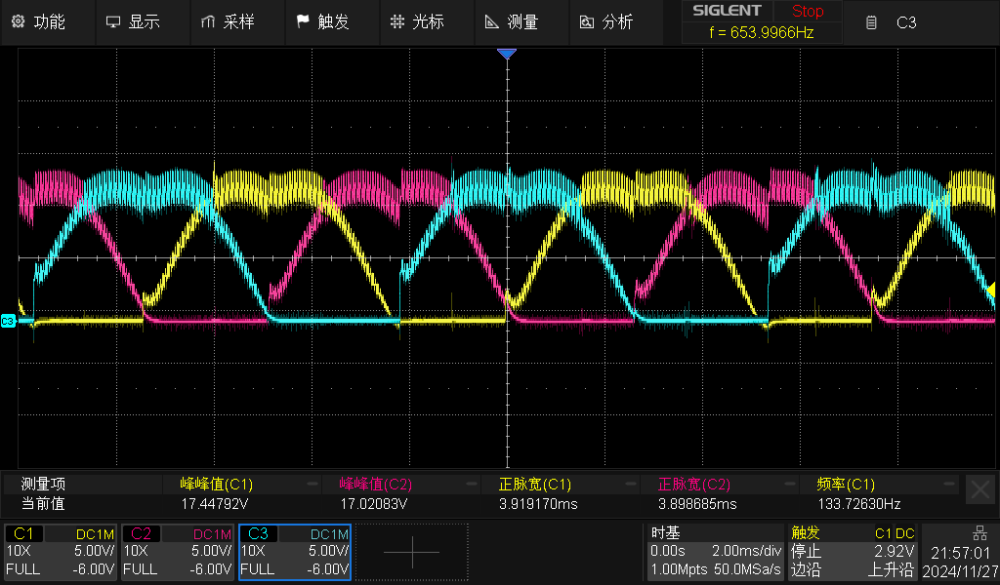

# 直流无刷电机控制（一）六步换相

## 直流无刷电机概述

直流无刷电机的转子为永磁铁，定子为换相线圈，有别于有刷电机通过电刷或者换向器换相，无刷电机通过控制器电子换相。

### 极对数

直流无刷电机采用永磁铁作为转子，一对NS磁极为一极对，为了使电机运转更加平滑，一般转子配有四极对或八极对的多极对。

### 槽数

直流无刷电机槽数一般指定子上的绕组线圈数，电机的线圈绕组通过嵌线工艺固定在定子槽中。因为直流无刷电机为三相电机，所以槽数一般为：

$$
槽数=3N
$$

### 机械角度和电角度

机械角度为电机转子轴相对于定子旋转的角度；而电机中一个观测点磁极发生由N变化至S（亦或者由S变化至N）则记为电角度旋转180°。

所以可得：

$$
电角度=机械角度 \times 极对数
$$

## 六步换相

六步换相是一种控制直流无刷电机的换相方法，通过控制定子中的电流，以实现电机转速和旋转方向上的控制。

六步换相有120°两相定子导通和180°三相定子导通两种导通模式，这里讨论的是更多场景下使用的120°导通模式。

六步换相并不是说必须有传感器估算电角度，只需要按照下述顺序（或反顺序）进行换相，在调制参数合适的情况下电机就有可能运转，区别只是在于运转的平滑性，带载丢步的概率或者说换相的成功概率。

为了提高电机换相的成功率，尤其是为了改善带载状态下的丢步问题，并使运转更加平滑，需要对电机转子电角度观测进行闭环换相（注意这里指的是换相闭环，并非电机控制中常见的电流环，速度环或位置环那样的控制器闭环）。

### 六步换向实际测量图示

## 霍尔传感器

电机中的霍尔传感器为单极性霍尔传感器，即在靠近N磁极时表现为高电平，在靠近S磁极表现为低电平。

直流无刷电机的霍尔传感器布置方式为120°和60°两种，对应着两种控制序列。

### 120°布置

因为120°布置，所以传感器ABC之间有着$\frac{4\pi}{3}$的相位差

### 60°布置

因为60°布置，所以传感器ABC之间有着$\frac{2\pi}{3}$的相位差

# BEMF观测器

（待补充）

