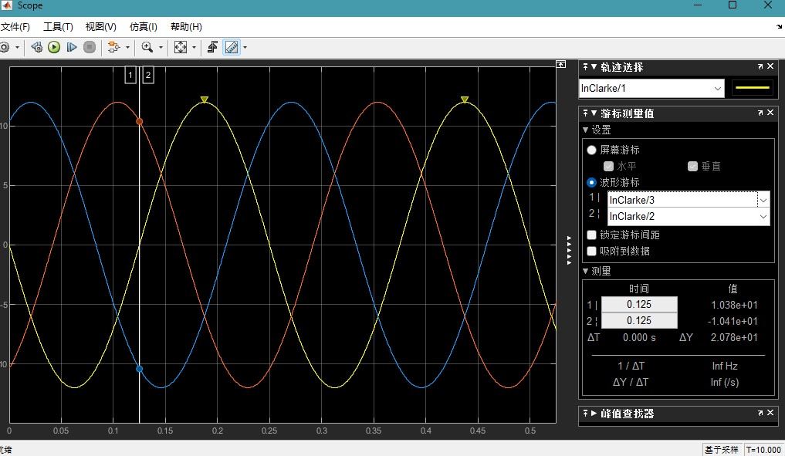
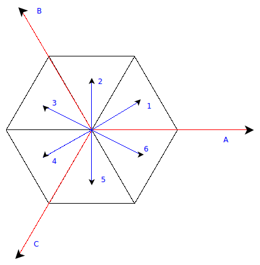

# 直流无刷电机控制（二）SVPWM调制

空间矢量调制（SVPWM）是目前流行的的电机控制调制方法，通过六组功率器件组成组成特定单元开关模式产生的脉宽调制波形，与传统的SPWM不同的是，SVPWM既可以获得理想的圆形磁链轨迹，有能最大化利用母线电压。

## SPWM母线电压利用缺陷

三相无刷电机最大磁场对应的电压为下图一绕组零电势，其余两绕组的相对电压。下图为SPWM调制的三相绕组电压情况：

由上图可知，在黄线为$\pi$，红线为$\frac{2}{3}\pi$，蓝线为$\frac{5}{3}\pi$时两绕组电压差为$\frac{\sqrt{3}}{2}$ Vbus。所以SPWM的母线电压利用率为$\frac{\sqrt{3}}{2}$。

为了将最大电压提高到100%母线电压，可以将以上波形放大$\frac{2\sqrt{3}}{3}$。但波形放大后，正弦波的峰峰值显然就会高于Vbus。

这里我们引入SVPWM去解决以上问题。

<!-- $$

\begin{align*}
\sin w&=sin(w+\frac{2}{3}\pi)\\
w&=\frac{\pi}{6}
\end{align*}

$$

可得$\frac{\pi}{6}+\frac{2}{3}k\pi$时，SPWM三相最大值周期。同理可得$\frac{\pi}{3}+\frac{\pi}{6}+\frac{2}{3}k\pi$即$\frac{\pi}{2}+\frac{2}{3}k\pi$。

SVPWM(Space Vector Pulse Width Modulation)相较于与SPWM(Sinusoidal Pulse Width Modulation)的区别与优势：

||SVPWM|SPWM|
|-|-|-|
|调制波形|马鞍波形|正弦波形|
|理想母线电压利用率|1|$\frac{\sqrt{3}}{2}$|
|调制方法|空间扇区判断调制|变频变压调制| -->

## SVPWM空间扇区

让我们复习六步换相的过程，六步换向即为六组MOS管组成的半桥电路，由一定的组合方式开合，从而使电机旋转的控制方法，以下为MOS组合开合方式与其对应的绕组合成的磁场矢量。

|绕组合成的磁场矢量所在扇区|电流方向|
|-|-|
|1|C到A|
|2|C到B|
|3|A到B|
|4|A到C|
|5|B到C|
|6|B到A|

## 电流与磁场的关系

根据毕奥-萨伐尔定律（Biot-Savart Law）的物理模型，从微观看磁场强度与电流的关系为：

$$

dB=\frac{\mu_0 I}{4 \pi} dL \times \frac{r-r'}{|r-r'|^3}

$$

dB为微小磁场，$\mu_0$为磁常数（真空磁导率为${\displaystyle \mu _{0}\approx 1.25663706212(19)\times 10^{-6}\,{\textrm {H}}\cdot {\textrm {m}}^{-1}}$），dL为为微小线元素，公式意为r'位置上的微小线元素dL有电流I，所产生于r的场位置的磁场强度。

## 空间扇区调制

上述空间扇区是由三相绕组的两相开关量组成的换相扇区，而真实的磁场则为三相绕组矢量合成的磁场矢量。

## 七段式SVPWM与5段式SVPWM
