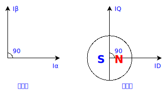

# 直流无刷电机控制（三）Clarke变换和Park变换

Clarke变换与Park变换将直流无刷电机三相绕组产生的磁力分析变换为转子$dq$轴的磁力分析，建立了三相绕组电压与转子受力之间的关系。

## Clarke变换

直流无刷电机三相绕组组成一套定子绕组，其相位差为$\frac{\pi}{3}$，将三相绕组产生的电磁力看成一个合力，再对其正交分解，那么称以上的运算为Clarke变换。

Clarke变换过程如下：

$$
\begin{align}
I_\alpha&=I_A-\cos \frac{2\pi}{3}I_B-\cos \frac{2\pi}{3}I_C=I_A-\frac{1}{2}(I_B+I_C)\\
I_\beta&=\sin\frac{2\pi}{3}I_B-\sin\frac{2\pi}{3}I_C=\frac{\sqrt{3}}{2}(I_B-I_C)
\end{align}
$$

或者以矩阵表达：

$$
\begin{equation}
\left[
\begin{matrix}
   I_\alpha \\
   I_\beta\\
\end{matrix}
\right]=\left[
\begin{matrix}
    1 & -\cos \frac{2\pi}{3} & -\cos \frac{2\pi}{3} \\\\
    0 & \sin\frac{2\pi}{3}   & -\sin\frac{2\pi}{3}  \\
\end{matrix}
\right]
\left[
\begin{matrix}
    I_A \\\\
    I_B \\\\
    I_C
\end{matrix}
\right]=\left[
\begin{matrix}
    I_A-\frac{1}{2}(I_B+I_C) \\
    \frac{\sqrt{3}}{2}(I_B-I_C) \\
\end{matrix}
\right]
\end{equation}
$$

### 等幅值变换

$\exist$时刻，合力方向与$I_A$方向相同，那么将$I_A$向量的模长设为单位1，且根据根据KCL定律（即基尔霍夫电流定律，流入的电流等于流出的电流）：

$$
\begin{align}
I_A+I_B+I_C&=0
\end{align}
$$

将式(4)与(1)联立可得合力的模长为

$$
\begin{align}
I_\alpha=\frac{3}{2}I_A
\end{align}
$$

将$I_\alpha$归一化处理，就需要将(1)(2)式等幅值缩小，系数为$\frac{2}{3}$：

$$
\begin{align}
I_\alpha&=\frac{2}{3}I_A-\frac{1}{3}(I_B+I_C)\\
I_\beta&=\frac{\sqrt{3}}{3}(I_B-I_C)
\end{align}
$$

假设$\exist$时刻$I_A+I_B+I_C=0$且$I_B=I_C$，那么可列如下矩阵：

$$
\begin{equation}
\left[
\begin{matrix}
   I_\alpha \\\\
   I_\beta \\
\end{matrix}
\right]=\left[
\begin{matrix}
    1 & -\cos \frac{2\pi}{3} & -\cos \frac{2\pi}{3} \\\\
    0 & \sin\frac{2\pi}{3}   & -\sin\frac{2\pi}{3}  \\
\end{matrix}
\right]\left[
\begin{matrix}
    1 \\\\
    -\frac{1}{2} \\\\
    -\frac{1}{2}
\end{matrix}
\right]=\left[
\begin{matrix}
   \frac{3}{2} \\\\
   0
\end{matrix}
\right]
\end{equation}
$$

则(3)式可转换为：

$$
\begin{equation}
\left[
\begin{matrix}
   I_\alpha \\\\
   I_\beta \\
\end{matrix}
\right]=\frac{2}{3}
\left[
\begin{matrix}
    1 & -\cos \frac{2\pi}{3} & -\cos \frac{2\pi}{3} \\\\
    0 & \sin\frac{2\pi}{3}   & -\sin\frac{2\pi}{3}  \\
\end{matrix}
\right]\left[
\begin{matrix}
    I_A \\\\
    I_B \\\\
    I_C
\end{matrix}
\right]=\left[
\begin{matrix}
    \frac{2}{3}I_A-\frac{1}{3}(I_B+I_C) \\
    \frac{\sqrt{3}}{3}(I_B-I_C) \\
\end{matrix}
\right]
\end{equation}
$$

## Park变换

Clarke变换出来的磁力依旧以定子作为坐标系，需要将$\alpha\beta$系上的磁力转换成以转子作为坐标系的$dq$系磁力进行分析，并$\alpha\beta$系的$\alpha$轴与$dq$系的q轴之间的夹角被称之为电角度$\theta$，上述转换被称之为Park变换。

Park变换过程如下：

$$
\begin{align}
I_d&=-\sin\theta I_\alpha+ \cos\theta I_\beta\\
I_q&=\cos\theta I_\alpha + \sin\theta I_\beta
\end{align}
$$

或者以矩阵表达：

$$
\begin{equation}
\left[
\begin{matrix}
   I_d \\
   I_q \\
\end{matrix}
\right]=\left[
\begin{matrix}
    -\sin\theta I_\alpha & \cos\theta I_\beta \\
    \cos\theta I_\alpha  & \sin\theta I_\beta \\
\end{matrix}
\right]\left[
\begin{matrix}
    I_\alpha \\
    I_\beta \\
\end{matrix}
\right]=\left[
\begin{matrix}
    -\sin\theta I_\alpha+ \cos\theta I_\beta\\
    \cos\theta I_\alpha + \sin\theta I_\beta\\
\end{matrix}
\right]
\end{equation}
$$

## Clarke逆变换与Park逆变换

当获取到转子的电角度$\theta$时，则通过逆Park变换和逆Clarke变换计算出三相绕组的PWM调制参数。

Clarke逆变换为：

$$
\begin{align}
I_A&=I_\alpha\\
I_B&=-\frac {1}{2}I_\alpha +\frac {\sqrt {3}}{2}I_\beta \\
I_C&=-\frac {1}{2}I_\alpha -\frac {\sqrt {3}}{2}I_\beta
\end{align}
$$

Park逆变换为：

$$
\begin{align}
I_\alpha&=\cos\theta I_d-\sin\theta I_q\\
I_\beta&=\sin \theta I_d+\cos\theta I_q
\end{align}
$$
